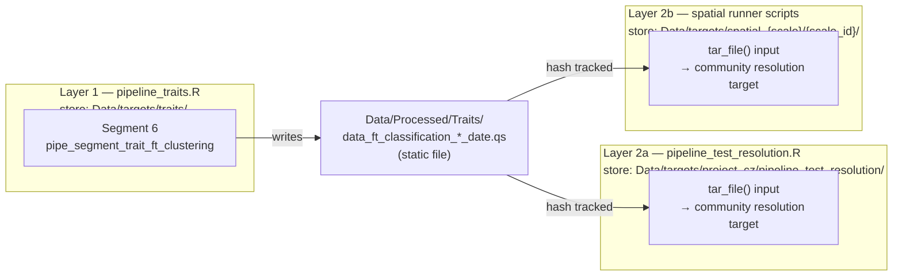

# Plan: Functional-Type Spatial Analyses (3-level taxonomy)

## TL;DR

Extend the existing spatial pipeline (continental/regional/local) to run at three taxonomic resolutions — **genus** (existing), **family**, and **Functional Types** (FT, derived from trait clustering). This requires:

1. expanding trait extraction to all VegVault domains + all continental extents,
2. a human-in-the-loop QC workflow for unit errors in raw trait values,
3. per-continent FT clustering,
4. integrating FT as a new `taxonomic_resolution` option in the pipeline,
5. a `tar_map()`-based new pipeline for family and FT resolutions (genus results already exist and are preserved), validated first on a single project before spatial scale-up, and
6. updated spatial runner scripts.

---

## Decisions

- **Scope**: Spatial only — `project_spatial_continental`, `project_spatial_regional`, `project_spatial_local` (3 scales × 2 new resolutions = 6 new pipeline runs per spatial unit; genus results already computed in the current per-unit stores and are not recomputed)
- **Temporal analyses excluded** from this plan
- **All VegVault trait domains** are used (no pre-filtering by coverage)
- **FT clustering**: Per continent — one FT classification per continental unit in `spatial_grid.csv`, reused for all regional/local units within it
- **Taxa without traits**: Dropped from FT analysis
- **k selection**: Data-driven — average silhouette width on hierarchical dendrogram cuts (k = 2..`k_max`)
- **Pipeline branching**: `tar_map()` over `spatial_grid.csv` rows × `c("family", "functional_type")` only — genus is excluded because results already exist and recomputing them would duplicate `04_Analyse_spatial_patterns.R` output; no separate `config.yml` entries needed
- **Genus results preserved**: Existing per-unit genus stores (`Data/targets/spatial_{scale}/{scale_id}/pipeline_basic/`) are not invalidated or touched; `04_Analyse_spatial_patterns.R` continues to read from them unchanged
- **Validation-first**: A new `pipeline_test_resolution.R` (Phase E0) runs all three resolutions on `project_cz` first; Phase F3 (full spatial scale-up for family + FT) starts only after this testbed passes for all resolutions
- **Human QC integration**: `tar_file()` + guard target (`trait_corrections_validated`) within `pipeline_traits.R`; pipeline stops automatically until corrections are marked `CHECKED = TRUE`
- **Convergence parameters**: `spatial_grid.csv` extended with resolution-specific columns (`n_iter_family`, `n_iter_ft`, etc.); values start as copies of genus-tuned values and are updated after convergence testing per resolution

---

## Architecture

### Two separate pipelines — different stores, file-based handoff

Layer 1 and Layers 2a/2b are **completely separate `{targets}` pipelines** with their own stores. They do not share targets. The only connection between them is a set of static `.qs` files written by Layer 1 to `Data/Processed/Traits/` and read by Layer 2 as `tar_file()` inputs.



**Consequence for "is Layer 1 up to date?"**

Layer 2 does **not** know whether Layer 1's internal targets are current. It only sees the `.qs` file hash via `tar_file()`. This means:

- If Layer 1 is stale (raw data changed, corrections file updated) but has NOT been re-run, Layer 2 will proceed with the old `.qs` file and will not warn.
- If Layer 1 IS re-run and the `.qs` file changes (different FT assignments, updated date stamp), `tar_file()` detects the hash change and automatically invalidates all downstream Layer 2 targets that depend on it.

**Required workflow**: Always run `targets::tar_make()` on `pipeline_traits.R` first, confirm it is fully up to date, then run Layer 2. This is enforced by documentation and the run order in `Run_trait_analyses.R`, not by {targets} itself.

---

**Layer 1 — `pipeline_traits.R`** (global, run once; store `Data/targets/traits/pipeline_traits`):

- Segment 1: `pipe_segment_trait_extraction` — dynamic branch per continent → `data_traits_raw` ✅
- Segment 2: `pipe_segment_trait_qc` — pre-classification QC, human guard on `trait_manual_corrections.csv` ✅
- Segment 3: `pipe_segment_trait_classification` — taxospace, finest available rank → `data_traits_classified` ✅
- Segment 4: `pipe_segment_trait_qc_classified` — post-classification QC, human guard on `trait_manual_corrections_classified.csv` ✅
- Segment 5: `pipe_segment_trait_table` — aggregate to median, pivot wide → global `data_trait_table` ✅
- Segment 6 _(to add — Phase D)_: `pipe_segment_trait_ft_clustering` — filter by `continent_id`, cluster FTs, write `Data/Processed/Traits/data_ft_classification_{continent_id}_{date}.qs`

**Layer 2a — `pipeline_test_resolution.R`** (Phase E0 — new testbed; store `Data/targets/project_cz/pipeline_test_resolution`): Reads FT `.qs` via `tar_file()`. Runs `project_cz` with `tarchetypes::tar_map()` over all three resolutions. Genus branch is a regression check against `pipeline_basic.R` output. Must fully pass before Phase F3.

**Layer 2b — spatial runner scripts** (Phase F3; each runner keeps its existing per-unit store): Read FT `.qs` via `tar_file()`. Embed `tar_map()` over `c("family", "functional_type")` only. Existing per-unit genus stores are untouched.

### Human-in-the-loop QC pattern (inside `pipeline_traits.R`)

```r
tar_target(trait_qc_report,
  generate_trait_qc_report(
    data_traits_raw,
    path_corrections = here::here("Data/Input/trait_manual_corrections.csv")
  )
),
tar_target(path_trait_corrections,
  here::here("Data/Input/trait_manual_corrections.csv"),
  format = "file"
),
tar_target(trait_corrections_validated,
  validate_trait_corrections(path_trait_corrections)
),
tar_target(data_traits_corrected,
  apply_trait_corrections(data_traits_raw, trait_corrections_validated)
)
```

On first `tar_make()`: pipeline stops at `trait_corrections_validated` with a `cli_abort()` message listing unchecked rows. A human edits `trait_manual_corrections.csv` and marks all rows `CHECKED = TRUE`. File hash changes → guard re-runs and passes → all downstream targets proceed automatically.

### Convergence parameters per resolution

`spatial_grid.csv` currently stores one set of fitting parameters (`n_iter`, `n_sampling`, etc.) per unit, tuned for genus-level models. Family and FT resolutions will have different community matrix dimensions and will likely require different values. New columns (`n_iter_family`, `n_iter_ft`, `n_sampling_family`, `n_sampling_ft`, and equivalents for other params) are added, defaulting to the genus values initially and updated per unit after convergence testing at each new resolution. The `tar_map()` pipeline selects the appropriate column based on `tax_res`.

---

## Phase A — Expand Trait Extraction (all traits, all continents) ✅ DONE

> **Status**: Completed. Closed by issue #58, implemented in PR #65. `pipe_segment_trait_extraction.R` dynamically discovers all VegVault trait domains and extracts per continental extent from `spatial_grid.csv`.

### A1 — Update `01_Extract_trait_data.R` to query all trait domains

- Remove hardcoded `c("Leaf mass per area", "Plant heigh")`
- Query VegVault to discover all available `trait_domain_name` values first (use `vaultkeepr` call, then `dplyr::distinct(trait_domain_name)`)
- Pass the full vector to `extract_traits_from_vegvault()`
- Output file name unchanged: `data_traits_{date}.qs`
- **Touches**: `R/02_Main_analyses/03_Trait_analyses/01_Extract_trait_data.R`

### A2 — Update extraction to cover all continental extents

- Currently hardcoded to `project_cz` continental bounding box; must run for all continental rows in `spatial_grid.csv`
- Loop over each unique continental row → extract traits for that bounding box → combine all into one `data_traits_{date}.qs` (with a `scale_id` column to identify continental origin)
- OR: extract globally (no geo filter) if VegVault performance allows — simpler but slower; decide based on testing
- **Touches**: `R/02_Main_analyses/03_Trait_analyses/01_Extract_trait_data.R`

---

## Phase B — Manual Trait QC Workflow ✅ DONE

> **Status**: Completed. Closed by issue #59, implemented in PR #66 (active). `pipe_segment_trait_qc.R` and `pipe_segment_trait_qc_classified.R` implement both pre- and post-classification QC passes with human guard targets (`trait_corrections_validated`, `trait_corrections_classified_validated`).

### B1 — Create `R/Functions/Traits/generate_trait_qc_report.R`

- TDD cycle (spec → tests → implement)
- **Input**: raw `data_traits` tibble (`taxon_name`, `trait_domain_name`, `trait_name`, `trait_value`)
- **Output**: list with (1) tibble summary per `trait_domain_name`: `n_records`, `n_taxa`, `mean`, `median`, `sd`, `p5`, `p95`, `IQR`, `suspected_unit_outliers` flag; (2) per-taxon × trait_domain summary; (3) vector of suspected problematic taxa (values > 10× IQR from median)
- Function saves a human-readable CSV to `Data/Temp/trait_qc_report_{date}.csv`
- **New file**: `R/Functions/Traits/generate_trait_qc_report.R`
- **Test file**: `R/03_Supplementary_analyses/testthat/test-generate_trait_qc_report.R`

### B2 — `trait_qc_report` target in `pipeline_traits.R`

- Calls `generate_trait_qc_report(data_traits_raw, path_corrections = ...)` as a `tar_target()` inside `pipeline_traits.R`
- If `trait_manual_corrections.csv` does not yet exist, the function writes a header-only template to `Data/Input/`; if the file already exists, it is left untouched (preserving human edits)
- A human-readable CSV is written to `Data/Temp/trait_qc_report_{date}.csv` as a side effect for review
- **The pipeline will stop at the next target (`trait_corrections_validated`) until a human marks all rows `CHECKED = TRUE` in `trait_manual_corrections.csv`**
- **Implemented in**: `pipeline_traits.R` (calls `generate_trait_qc_report()` from issue #3)

### B3 — Create `Data/Input/trait_manual_corrections.csv` template

- Columns: `taxon_name`, `trait_domain_name`, `action` (`exclude` | `scale`), `scale_factor` (numeric; applied as `trait_value * scale_factor`), `notes`
- Start as header-only template committed to repo
- A human fills this in AFTER reviewing the QC report
- Analogous to `Data/Input/aux_classification_table.csv`
- **New file**: `Data/Input/trait_manual_corrections.csv`

### B4 — Create `R/Functions/Traits/apply_trait_corrections.R`

- TDD cycle
- **Input**: `data_traits` tibble, path to corrections CSV
- **Output**: `data_traits` with `exclude` rows removed and `scale` rows multiplied by `scale_factor`
- Validates that all rows in the corrections CSV match (`taxon_name` × `trait_domain_name`) records present in the trait data; warns on unmatched rows
- **New file**: `R/Functions/Traits/apply_trait_corrections.R`
- **Test file**: `R/03_Supplementary_analyses/testthat/test-apply_trait_corrections.R`

### B4b — Create `R/Functions/Traits/validate_trait_corrections.R`

- TDD cycle
- **Input**: path to `trait_manual_corrections.csv`
- **Behaviour**: reads the file; `cli::cli_abort()` if any row has `CHECKED` that is `NA` or not `TRUE`, listing the offending rows; returns the validated corrections tibble on success
- **Purpose**: acts as the pipeline guard — downstream targets cannot proceed until a human has explicitly reviewed and signed off every row
- Error message format: `"{n} row(s) in trait_manual_corrections.csv not yet validated. Review the QC report, fill action/scale_factor, set CHECKED = TRUE."`
- **New file**: `R/Functions/Traits/validate_trait_corrections.R`
- **Test file**: `R/03_Supplementary_analyses/testthat/test-validate_trait_corrections.R`

### B5 — Update `02_Classify_and_align_taxa.R` to apply corrections

- Call `apply_trait_corrections()` immediately after loading raw trait data, before classification
- Ensures corrected and excluded records propagate forward
- **Touches**: `R/02_Main_analyses/03_Trait_analyses/02_Classify_and_align_taxa.R`

### B6 — Update `Run_trait_analyses.R` to invoke `pipeline_traits.R`

- Replace individual `source()` calls with `targets::tar_make()` pointing at `pipeline_traits.R` as the entry point for all trait analyses
- Add a prominent comment block explaining the human-review pause: the pipeline stops automatically at `trait_corrections_validated`; do not bypass or skip this target
- **Touches**: `R/02_Main_analyses/03_Trait_analyses/Run_trait_analyses.R`

---

## Phase C — Build Expanded Trait Table (all domains, per continent)

### C1 — Update `R/Functions/Traits/make_trait_table.R` to handle N traits

- Confirm or fix the pivot so any number of trait domains (not just 2) become wide columns
- If already generic (uses `pivot_wider(names_from = trait_domain_name)`), confirm and add a test; if hardcoded, generalise
- **Touches**: `R/Functions/Traits/make_trait_table.R` (and its test file)

### C2 — Architecture change: single global trait table ✅ DONE (architecture revised)

> **Status**: The per-continent files approach was superseded. `pipe_segment_trait_table.R` (Segment 5 of `pipeline_traits.R`) produces one global `data_trait_table` — a wide resolved-taxon × traits matrix covering all continents and closed by PR #66 with the architecture change.

- C1 (generalise `make_trait_table.R` for N domains) is implemented in `pipe_segment_trait_table.R`
- **No per-continent `.qs` files** — FT clustering (Phase D, Segment 6) filters the global table internally by `continent_id`
- `03_Build_trait_table.R` is replaced by `pipe_segment_trait_table.R`

---

## Phase D — Functional Type Clustering

### D1 — Create `R/Functions/Traits/cluster_functional_types.R`

- TDD cycle
- **Input**: wide trait table (taxon × trait_domain columns), `k_max` (max number of clusters to test, default 10)
- **Pre-processing**: no NA removal and no z-score scaling — Gower distance handles NAs and mixed scales natively
- **Distance**: `cluster::daisy(data, metric = "gower")` — handles missing trait values and different trait scales without pre-processing
- **Clustering**: `stats::hclust(dist_matrix, method = "ward.D2")` — hierarchical clustering on the Gower distance matrix
- **k selection**: cut the dendrogram at k = 2..`k_max`; compute average silhouette width for each k using `cluster::silhouette(stats::cutree(hclust_obj, k), dist_matrix)`; select k maximising silhouette
- **Output**: tibble with columns `taxon`, `functional_type` (integer label 1..k), `silhouette_width`; attribute `k_chosen` attached
- **New file**: `R/Functions/Traits/cluster_functional_types.R`
- **Test file**: `R/03_Supplementary_analyses/testthat/test-cluster_functional_types.R`

### D2 — Add FT clustering as Segment 6 of `pipeline_traits.R`

- Segment 6 is added to the existing `pipeline_traits.R` (not a standalone analysis script)
- Iterates over continental spatial units from `spatial_grid.csv`; for each, filters the global `data_trait_table` on `continent_id`, calls `cluster_functional_types()`
- Saves `Data/Processed/Traits/data_ft_classification_{continent_id}_{date}.qs` as a static file; downstream spatial pipelines consume it via `tar_file()` input
- Prints k chosen and silhouette summary per continent
- **Touches**: `R/02_Main_analyses/pipeline_traits.R` (add Segment 6)
- **New file**: `R/02_Main_analyses/_pipes/pipe_segment_trait_ft_clustering.R`

### D3 — `pipeline_traits.R` — already exists (add Segment 6)

- `R/02_Main_analyses/pipeline_traits.R` already exists with 5 segments (Phases A–C ✅)
- Segment 6 (`pipe_segment_trait_ft_clustering.R`) is added once D1 is complete
- Target store: `Data/targets/traits/pipeline_traits`
- **Touches**: `R/02_Main_analyses/pipeline_traits.R`

---

---

## Phase E0 — Resolution-Testing Mini Pipeline _(new — prerequisite to Phase F3)_

Before embedding resolution branching into the full spatial scale, validate it end-to-end on a single named project (`project_cz`).

### E0a — Create `pipe_segment_community_resolution.R`

- **New pipe segment** sitting **downstream** of the existing `pipe_segment_community_data.R` — that segment is unchanged
- `pipe_segment_community_data.R` continues to resolve community taxa to finest available rank and produce `data_community_classified` as it does today
- The new segment receives `data_community_classified` and collapses it to a target taxonomic resolution via an explicit `tax_res` parameter passed by `tarchetypes::tar_map()`
- Routing:
  - `"genus"` / `"family"` → `classify_taxonomic_resolution(data_community_classified, tax_res)`
  - `"functional_type"` → `classify_to_functional_type(data_community_classified, data_ft_classification)` where `data_ft_classification` is loaded via `tar_file()` pointing to `Data/Processed/Traits/data_ft_classification_{continent_id}_{date}.qs`
- Output target: `data_community_resolved` — same long-format shape as `data_community_classified`; taxon column replaced by the resolution-level label (e.g. `"FT_3"`)
- **New file**: `R/02_Main_analyses/_pipes/pipe_segment_community_resolution.R`

### E0b — Create `pipeline_test_resolution.R`

- Small standalone testbed pipeline for validating all three resolutions on `project_cz`
- Sets `R_CONFIG_ACTIVE = "project_cz"` (or reads from environment)
- Sources `pipe_segment_community_data.R` once (shared; no branching on this segment)
- `tarchetypes::tar_map()` over `tax_res = c("genus", "family", "functional_type")`:
  - `pipe_segment_community_resolution.R` → `data_community_resolved_{tax_res}`
  - downstream segments (fit_data_prep → model_prep → model_simple → model_anova) → `model_anova_{tax_res}`
- Target store: `Data/targets/project_cz/pipeline_test_resolution/`
- **New file**: `R/02_Main_analyses/pipeline_test_resolution.R`

### F0 — Validation gate (prerequisite to Phase F3)

1. Run `pipeline_test_resolution.R` with `tax_res = "genus"` first. `model_anova_genus` output must match the existing `pipeline_basic.R` result for `project_cz`. If it does not match, fix `pipe_segment_community_resolution.R` before proceeding.
2. Run for `tax_res = "family"` and `"functional_type"`. All targets complete without error.
3. Full test suite (`Rscript R/03_Supplementary_analyses/Run_tests.R`) passes.
4. **Only after all three steps pass**: proceed to Phase F3.

---

## Phase E — Integrate Functional Types into the Pipeline

### E1 — Create `R/Functions/Traits/get_functional_type_classification.R`

- TDD cycle
- **Input**: `continent_id` (character), `path_processed` (default `here::here("Data/Processed")`)
- Finds the most recent `data_ft_classification_{continent_id}_{date}.qs` in `Data/Processed/`
- **Output**: tibble with columns `taxon`, `functional_type`
- **New file**: `R/Functions/Traits/get_functional_type_classification.R`
- **Test file**: `R/03_Supplementary_analyses/testthat/test-get_functional_type_classification.R`

### E2 — Design note: FT pathway in `pipe_segment_community_data.R`

The existing `classify_taxonomic_resolution()` uses a standard taxonomic table (`sel_name × kingdom…species`). FT uses a different structure (`taxon → functional_type` integer), so the plan uses a separate `classify_to_functional_type()` function.

- If `taxonomic_resolution == "functional_type"`, call `classify_to_functional_type()`
- Otherwise, use the existing `classify_taxonomic_resolution()` path unchanged

### E3 — Create `R/Functions/Community/classify_to_functional_type.R`

- TDD cycle
- **Input**: `data` (long community data with `taxon`, `dataset_name`, `age`, `pollen_prop`), `data_ft_classification` (taxon → functional_type tibble)
- **Output**: same long format but `taxon` replaced by `FT_{n}` labels; `pollen_prop` aggregated by (`dataset_name`, `age`, `functional_type`); taxa absent from the FT table are dropped with `cli::cli_warn()`
- Mirrors the output contract of `classify_taxonomic_resolution()` for drop-in replacement downstream
- **New file**: `R/Functions/Community/classify_to_functional_type.R`
- **Test file**: `R/03_Supplementary_analyses/testthat/test-classify_to_functional_type.R`

### E4 — `get_continent_id_from_config()` — **ELIMINATED**

Previously planned to infer the continental `scale_id` from bounding box values in the active config. With `tar_map()`, `continent_id` is passed directly as an explicit parameter in the branching values table. No inference from config is needed and this function is not required.

### E5 — `pipe_segment_community_data.R` — NO CHANGES

The existing segment resolves community taxa to finest available rank (`data_community_classified`) and is not modified. Resolution branching is handled entirely by the new `pipe_segment_community_resolution.R` (Phase E0a), which sits downstream of this segment.

- `pipe_segment_community_data.R` remains unchanged
- Resolution routing (genus / family / FT) lives in `pipe_segment_community_resolution.R`

---

## Phase F — Spatial Pipeline Refactor

### F1 — `_family` and `_ft` config entries — **ELIMINATED**

The `inherits:`-based config entries (`project_spatial_continental_family`, `project_spatial_regional_ft`, etc.) are no longer required. Taxonomic resolution branching is handled internally by `tar_map()` within `pipeline_basic.R`, not by separate config environments. `config.yml` is unchanged.

### F2 — Extend `spatial_grid.csv` with resolution-specific fitting parameters

- Add columns: `n_iter_family`, `n_iter_ft`, `n_sampling_family`, `n_sampling_ft`, `n_step_size_family`, `n_step_size_ft`, `n_early_stopping_family`, `n_early_stopping_ft`
- Initial values: copies of the existing genus-tuned columns
- Values updated per unit after convergence testing at each new resolution
- The pipeline reads the appropriate columns based on `tax_res`
- **Touches**: `Data/Input/spatial_grid.csv`

### F3 — Extend spatial runner scripts to use `tar_map()` for family and FT only

**Prerequisite**: Phase F0 (E0 validation) must pass before this phase starts.

- Genus results in existing per-unit stores (`Data/targets/spatial_{scale}/{scale_id}/pipeline_basic/`) are **preserved and not recomputed** — recomputing them would duplicate the validated results already read by `04_Analyse_spatial_patterns.R`
- `tar_map()` is added over `c("family", "functional_type")` only, producing named targets per unit × resolution (e.g. `model_anova_eu_r001_family`, `model_anova_eu_r001_ft`)
- Spatial runner scripts continue to iterate over `scale_ids` from `spatial_grid.csv`; within each unit, the new `tar_map()` runs the family and FT pipelines alongside the untouched genus store
- The resolution branching lives in `pipe_segment_community_resolution.R` (Phase E0a) — `pipeline_basic.R` itself is not structurally changed for the genus path
- **Touches**: `R/02_Main_analyses/01_Spatial/01_Run_spatial_continental.R`, `02_Run_spatial_regional.R`, `03_Run_spatial_local.R`
- **Does NOT change**: existing genus target stores or `04_Analyse_spatial_patterns.R`

---

## Phase G — Analysis & Comparison

### G1 — Script: combine results across resolutions

- Reads **genus** ANOVA results from the existing per-unit stores using the same pattern as `04_Analyse_spatial_patterns.R` (`Data/targets/spatial_{scale}/{scale_id}/pipeline_basic/`, target name `model_anova`)
- Reads **family and FT** ANOVA results from the new `tar_map()` stores produced in Phase F3 (target names `model_anova_{scale_id}_family`, `model_anova_{scale_id}_ft`)
- Combines all three into a long tibble with a `taxonomic_resolution` column (`"genus"` | `"family"` | `"functional_type"`)
- Save to `Outputs/Data/`
- **New file**: `R/02_Main_analyses/01_Spatial/07_Compare_resolutions.R`

### G2 — Script: plot resolution comparison

- Plot ANOVA variance fractions (environment / space / biotic co-occurrence) by resolution and spatial scale
- **New file**: `R/02_Main_analyses/01_Spatial/08_Plot_resolution_comparison.R`

---

## Relevant Files

| File | Change |
|------|--------|
| `R/02_Main_analyses/pipeline_traits.R` | exists with 5 segments ✅; add Segment 6 (Phase D) |
| `R/02_Main_analyses/_pipes/pipe_segment_trait_ft_clustering.R` | **new** — Segment 6, Phase D |
| `R/02_Main_analyses/pipeline_test_resolution.R` | **new** — Phase E0 testbed |
| `R/02_Main_analyses/_pipes/pipe_segment_community_resolution.R` | **new** — Phase E0a; resolution routing downstream of community data segment |
| `R/02_Main_analyses/_pipes/pipe_segment_community_data.R` | **NO CHANGES** |
| `R/02_Main_analyses/pipeline_basic.R` | **NO CHANGES** to structure; genus path untouched |
| `R/02_Main_analyses/01_Spatial/01_Run_spatial_continental.R` | add `tar_map()` over family + FT (Phase F3) |
| `R/02_Main_analyses/01_Spatial/02_Run_spatial_regional.R` | add `tar_map()` over family + FT (Phase F3) |
| `R/02_Main_analyses/01_Spatial/03_Run_spatial_local.R` | add `tar_map()` over family + FT (Phase F3) |
| `R/02_Main_analyses/01_Spatial/07_Compare_resolutions.R` | **new** — Phase G1 |
| `R/02_Main_analyses/01_Spatial/08_Plot_resolution_comparison.R` | **new** — Phase G2 |
| `Data/Input/spatial_grid.csv` | extend with resolution-specific fitting parameter columns (Phase F2) |
| `Data/Input/trait_manual_corrections.csv` | exists ✅; CSV with `CHECKED` column |
| `R/Functions/Traits/generate_trait_qc_report.R` | exists ✅ |
| `R/Functions/Traits/apply_trait_corrections.R` | exists ✅ |
| `R/Functions/Traits/validate_trait_corrections.R` | exists ✅ — pipeline guard |
| `R/Functions/Traits/make_trait_table.R` | exists ✅; generalised for N domains |
| `R/Functions/Traits/cluster_functional_types.R` | **new** — Phase D1 |
| `R/Functions/Traits/get_functional_type_classification.R` | **new** — Phase E1 |
| `R/Functions/Community/classify_to_functional_type.R` | **new** — Phase E3 |
| `config.yml` | unchanged |

---

## GitHub Issue Map — Current Status

| # | Parent | Phase | Short description | Status |
|---|--------|-------|-------------------|--------|
| [#17](https://github.com/OndrejMottl/BIODYNAMICS-vegetation-cooccurrence/issues/17) | — | Umbrella | Add 3 axes of study (broad parent) | 🟢 open |
| [#57](https://github.com/OndrejMottl/BIODYNAMICS-vegetation-cooccurrence/issues/57) | #17 | Umbrella | Functional-type spatial analyses (FT-specific umbrella) | 🟢 open |
| [#58](https://github.com/OndrejMottl/BIODYNAMICS-vegetation-cooccurrence/issues/58) | #57 | A | Expand trait extraction to all VegVault domains and continental extents | ✅ closed (PR #65) |
| [#59](https://github.com/OndrejMottl/BIODYNAMICS-vegetation-cooccurrence/issues/59) | #57 | B | Manual trait QC workflow in `pipeline_traits.R` (guard + corrections) | 🟡 open — implemented in PR #66, closes on merge |
| [#60](https://github.com/OndrejMottl/BIODYNAMICS-vegetation-cooccurrence/issues/60) | #57 | C | Trait table (architecture revised: single global `data_trait_table`, not per-continent) | 🟡 open — implemented in PR #66, closes on merge |
| [#20](https://github.com/OndrejMottl/BIODYNAMICS-vegetation-cooccurrence/issues/20) | #57 | D | FT clustering as Segment 6 of `pipeline_traits.R`; filter global table by `continent_id` | 🟢 open |
| [#61](https://github.com/OndrejMottl/BIODYNAMICS-vegetation-cooccurrence/issues/61) | #57 | E0a + E3 | New `pipe_segment_community_resolution.R` downstream of community data segment; `classify_to_functional_type()` | 🟢 open |
| [#67](https://github.com/OndrejMottl/BIODYNAMICS-vegetation-cooccurrence/issues/67) | #57 | E0b | Resolution-testing mini pipeline (`pipeline_test_resolution.R`) + F0 validation gate on `project_cz` | 🟢 open |
| [#62](https://github.com/OndrejMottl/BIODYNAMICS-vegetation-cooccurrence/issues/62) | #57 | F2 | Extend `spatial_grid.csv` with resolution-specific convergence parameters | 🟢 open |
| [#18](https://github.com/OndrejMottl/BIODYNAMICS-vegetation-cooccurrence/issues/18) | #57 | F3 | Add `tar_map()` for family + FT to spatial runner scripts; genus stores untouched | 🟢 open |
| [#63](https://github.com/OndrejMottl/BIODYNAMICS-vegetation-cooccurrence/issues/63) | #57 | G | Cross-resolution comparison outputs (combine + plot ANOVA variance fractions) | 🟢 open |
| [#21](https://github.com/OndrejMottl/BIODYNAMICS-vegetation-cooccurrence/issues/21) | — | — | Extract full taxonomy (superseded by taxospace in `pipe_segment_trait_classification.R`) | ✅ closed (superseded) |

---

## Open Questions

1. **Global vs per-continent extraction**: Extracting globally (no bounding box) is simpler but slower. Worth a quick test run to check VegVault timing before committing to the per-continent loop.

2. **Clustering algorithm — DECIDED**: Gower distance (`cluster::daisy(metric = "gower")`) + `stats::hclust(method = "ward.D2")`. Gower distance handles NA trait values natively (no taxon dropping for missing traits) and is scale-invariant, making it appropriate for mixed plant trait data. k selection via average silhouette width on dendrogram cuts.

3. **Convergence testing sequence (F2 + F3)**: Resolution-specific fitting parameters in `spatial_grid.csv` cannot be finalised until at least one round of family and FT model runs has been attempted. The F2 columns are added with genus defaults; they should be updated as part of Phase F3 once initial runs reveal convergence problems.

---

## Verification Checklist

- [ ] After Phase D: `pipeline_traits.R` Segment 6 completes — `data_ft_classification_{continent_id}_{date}.qs` exists for each continental unit; k chosen and silhouette scores printed
- [ ] After Phase E0a: `pipe_segment_community_resolution.R` routes correctly — community data is classified to genus/family/FT depending on `tax_res`
- [ ] After Phase E0b: `pipeline_test_resolution.R` runs all 3 resolutions for `project_cz` without error
- [ ] F0 gate: genus output from `pipeline_test_resolution.R` matches existing `pipeline_basic.R` output for `project_cz`
- [ ] After Phase F3: family and FT `model_anova` targets generated for all spatial units; existing per-unit genus stores untouched; `04_Analyse_spatial_patterns.R` still reads genus results correctly
- [ ] After any function work: `Rscript R/03_Supplementary_analyses/Run_tests.R` passes without error
- [ ] After Phase G: comparison plots render without error
