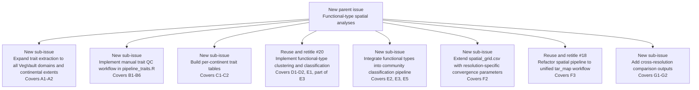

# Plan: Functional-Type Spatial Analyses (3-level taxonomy)

## TL;DR

Extend the existing spatial pipeline (continental/regional/local) to run at three taxonomic resolutions — **genus** (existing), **family**, and **Functional Types** (FT, derived from trait clustering). This requires:

1. expanding trait extraction to all VegVault domains + all continental extents,
2. a human-in-the-loop QC workflow for unit errors in raw trait values,
3. per-continent FT clustering,
4. integrating FT as a new `taxonomic_resolution` option in the pipeline,
5. a `tar_map()`-based unified spatial pipeline branching over spatial units × resolutions, and
6. updated spatial runner scripts.

---

## Decisions

- **Scope**: Spatial only — `project_spatial_continental`, `project_spatial_regional`, `project_spatial_local` (3 scales × 3 resolutions = 9 pipeline runs per spatial unit)
- **Temporal analyses excluded** from this plan
- **All VegVault trait domains** are used (no pre-filtering by coverage)
- **FT clustering**: Per continent — one FT classification per continental unit in `spatial_grid.csv`, reused for all regional/local units within it
- **Taxa without traits**: Dropped from FT analysis
- **k selection**: Data-driven — average silhouette width on hierarchical dendrogram cuts (k = 2..`k_max`)
- **Pipeline branching**: `tar_map()` over `spatial_grid.csv` rows × `c("genus", "family", "functional_type")` inside `pipeline_basic.R` — no separate `config.yml` entries per resolution needed
- **Cache tradeoff accepted**: Refactoring to unified `tar_map()` target names will invalidate the current saved spatial targets once; this is accepted in exchange for cleaner structure and easier full reruns before submission
- **Human QC integration**: `tar_file()` + guard target (`trait_corrections_validated`) within `pipeline_traits.R`; pipeline stops automatically until corrections are marked `CHECKED = TRUE`
- **Convergence parameters**: `spatial_grid.csv` extended with resolution-specific columns (`n_iter_family`, `n_iter_ft`, etc.); values start as copies of genus-tuned values and are updated after convergence testing per resolution

---

## Architecture

### Two-pipeline structure

**Layer 1 — `pipeline_traits.R`** (global, run once before spatial analyses): Extracts all trait domains for all continental extents → generates QC report → writes `trait_manual_corrections.csv` template if absent → tracks file hash as `tar_file()` → validates human sign-off via guard target → applies corrections → classifies taxa → builds per-continent trait tables → clusters FTs per continent. Outputs static `.qs` files in `Data/Processed/`, each tracked as a `tar_file()` input by the spatial pipeline.

**Layer 2 — `pipeline_basic.R`** (unified spatial pipeline, branched via `tar_map()`): iterates over `spatial_grid.csv` rows × `c("genus", "family", "functional_type")`. Each combination produces its own named targets (e.g. `model_anova_eu_r001_genus`); {targets} caches and invalidates only what is out of date within the unified pipeline store for the active spatial config. This refactor replaces the current per-unit store layout and requires one full rebuild of saved spatial targets after implementation.

### Human-in-the-loop QC pattern (inside `pipeline_traits.R`)

```r
tar_target(trait_qc_report,
  generate_trait_qc_report(
    data_traits_raw,
    path_corrections = here::here("Data/Input/trait_manual_corrections.csv")
  )
),
tar_target(path_trait_corrections,
  here::here("Data/Input/trait_manual_corrections.csv"),
  format = "file"
),
tar_target(trait_corrections_validated,
  validate_trait_corrections(path_trait_corrections)
),
tar_target(data_traits_corrected,
  apply_trait_corrections(data_traits_raw, trait_corrections_validated)
)
```

On first `tar_make()`: pipeline stops at `trait_corrections_validated` with a `cli_abort()` message listing unchecked rows. A human edits `trait_manual_corrections.csv` and marks all rows `CHECKED = TRUE`. File hash changes → guard re-runs and passes → all downstream targets proceed automatically.

### Convergence parameters per resolution

`spatial_grid.csv` currently stores one set of fitting parameters (`n_iter`, `n_sampling`, etc.) per unit, tuned for genus-level models. Family and FT resolutions will have different community matrix dimensions and will likely require different values. New columns (`n_iter_family`, `n_iter_ft`, `n_sampling_family`, `n_sampling_ft`, and equivalents for other params) are added, defaulting to the genus values initially and updated per unit after convergence testing at each new resolution. The `tar_map()` pipeline selects the appropriate column based on `tax_res`.

---

## Phase A — Expand Trait Extraction (all traits, all continents)

### A1 — Update `01_Extract_trait_data.R` to query all trait domains

- Remove hardcoded `c("Leaf mass per area", "Plant heigh")`
- Query VegVault to discover all available `trait_domain_name` values first (use `vaultkeepr` call, then `dplyr::distinct(trait_domain_name)`)
- Pass the full vector to `extract_traits_from_vegvault()`
- Output file name unchanged: `data_traits_{date}.qs`
- **Touches**: `R/02_Main_analyses/03_Trait_analyses/01_Extract_trait_data.R`

### A2 — Update extraction to cover all continental extents

- Currently hardcoded to `project_cz` continental bounding box; must run for all continental rows in `spatial_grid.csv`
- Loop over each unique continental row → extract traits for that bounding box → combine all into one `data_traits_{date}.qs` (with a `scale_id` column to identify continental origin)
- OR: extract globally (no geo filter) if VegVault performance allows — simpler but slower; decide based on testing
- **Touches**: `R/02_Main_analyses/03_Trait_analyses/01_Extract_trait_data.R`

---

## Phase B — Manual Trait QC Workflow

### B1 — Create `R/Functions/Traits/generate_trait_qc_report.R`

- TDD cycle (spec → tests → implement)
- **Input**: raw `data_traits` tibble (`taxon_name`, `trait_domain_name`, `trait_name`, `trait_value`)
- **Output**: list with (1) tibble summary per `trait_domain_name`: `n_records`, `n_taxa`, `mean`, `median`, `sd`, `p5`, `p95`, `IQR`, `suspected_unit_outliers` flag; (2) per-taxon × trait_domain summary; (3) vector of suspected problematic taxa (values > 10× IQR from median)
- Function saves a human-readable CSV to `Data/Temp/trait_qc_report_{date}.csv`
- **New file**: `R/Functions/Traits/generate_trait_qc_report.R`
- **Test file**: `R/03_Supplementary_analyses/testthat/test-generate_trait_qc_report.R`

### B2 — `trait_qc_report` target in `pipeline_traits.R`

- Calls `generate_trait_qc_report(data_traits_raw, path_corrections = ...)` as a `tar_target()` inside `pipeline_traits.R`
- If `trait_manual_corrections.csv` does not yet exist, the function writes a header-only template to `Data/Input/`; if the file already exists, it is left untouched (preserving human edits)
- A human-readable CSV is written to `Data/Temp/trait_qc_report_{date}.csv` as a side effect for review
- **The pipeline will stop at the next target (`trait_corrections_validated`) until a human marks all rows `CHECKED = TRUE` in `trait_manual_corrections.csv`**
- **Implemented in**: `pipeline_traits.R` (calls `generate_trait_qc_report()` from issue #3)

### B3 — Create `Data/Input/trait_manual_corrections.csv` template

- Columns: `taxon_name`, `trait_domain_name`, `action` (`exclude` | `scale`), `scale_factor` (numeric; applied as `trait_value * scale_factor`), `notes`
- Start as header-only template committed to repo
- A human fills this in AFTER reviewing the QC report
- Analogous to `Data/Input/aux_classification_table.csv`
- **New file**: `Data/Input/trait_manual_corrections.csv`

### B4 — Create `R/Functions/Traits/apply_trait_corrections.R`

- TDD cycle
- **Input**: `data_traits` tibble, path to corrections CSV
- **Output**: `data_traits` with `exclude` rows removed and `scale` rows multiplied by `scale_factor`
- Validates that all rows in the corrections CSV match (`taxon_name` × `trait_domain_name`) records present in the trait data; warns on unmatched rows
- **New file**: `R/Functions/Traits/apply_trait_corrections.R`
- **Test file**: `R/03_Supplementary_analyses/testthat/test-apply_trait_corrections.R`

### B4b — Create `R/Functions/Traits/validate_trait_corrections.R`

- TDD cycle
- **Input**: path to `trait_manual_corrections.csv`
- **Behaviour**: reads the file; `cli::cli_abort()` if any row has `CHECKED` that is `NA` or not `TRUE`, listing the offending rows; returns the validated corrections tibble on success
- **Purpose**: acts as the pipeline guard — downstream targets cannot proceed until a human has explicitly reviewed and signed off every row
- Error message format: `"{n} row(s) in trait_manual_corrections.csv not yet validated. Review the QC report, fill action/scale_factor, set CHECKED = TRUE."`
- **New file**: `R/Functions/Traits/validate_trait_corrections.R`
- **Test file**: `R/03_Supplementary_analyses/testthat/test-validate_trait_corrections.R`

### B5 — Update `02_Classify_and_align_taxa.R` to apply corrections

- Call `apply_trait_corrections()` immediately after loading raw trait data, before classification
- Ensures corrected and excluded records propagate forward
- **Touches**: `R/02_Main_analyses/03_Trait_analyses/02_Classify_and_align_taxa.R`

### B6 — Update `Run_trait_analyses.R` to invoke `pipeline_traits.R`

- Replace individual `source()` calls with `targets::tar_make()` pointing at `pipeline_traits.R` as the entry point for all trait analyses
- Add a prominent comment block explaining the human-review pause: the pipeline stops automatically at `trait_corrections_validated`; do not bypass or skip this target
- **Touches**: `R/02_Main_analyses/03_Trait_analyses/Run_trait_analyses.R`

---

## Phase C — Build Expanded Trait Table (all domains, per continent)

### C1 — Update `R/Functions/Traits/make_trait_table.R` to handle N traits

- Confirm or fix the pivot so any number of trait domains (not just 2) become wide columns
- If already generic (uses `pivot_wider(names_from = trait_domain_name)`), confirm and add a test; if hardcoded, generalise
- **Touches**: `R/Functions/Traits/make_trait_table.R` (and its test file)

### C2 — Update `03_Build_trait_table.R` to output per-continent tables

- Build one trait table per continental spatial unit (from `spatial_grid.csv`)
- Saves `data_trait_table_{continent_id}_{date}.qs` per continent to `Data/Processed/`
- **Touches**: `R/02_Main_analyses/03_Trait_analyses/03_Build_trait_table.R`

---

## Phase D — Functional Type Clustering

### D1 — Create `R/Functions/Traits/cluster_functional_types.R`

- TDD cycle
- **Input**: wide trait table (taxon × trait_domain columns), `k_max` (max number of clusters to test, default 10)
- **Pre-processing**: no NA removal and no z-score scaling — Gower distance handles NAs and mixed scales natively
- **Distance**: `cluster::daisy(data, metric = "gower")` — handles missing trait values and different trait scales without pre-processing
- **Clustering**: `stats::hclust(dist_matrix, method = "ward.D2")` — hierarchical clustering on the Gower distance matrix
- **k selection**: cut the dendrogram at k = 2..`k_max`; compute average silhouette width for each k using `cluster::silhouette(stats::cutree(hclust_obj, k), dist_matrix)`; select k maximising silhouette
- **Output**: tibble with columns `taxon`, `functional_type` (integer label 1..k), `silhouette_width`; attribute `k_chosen` attached
- **New file**: `R/Functions/Traits/cluster_functional_types.R`
- **Test file**: `R/03_Supplementary_analyses/testthat/test-cluster_functional_types.R`

### D2 — Create `05_Cluster_functional_types.R` analysis script

- Sources setup
- Iterates over continental spatial units from `spatial_grid.csv`
- For each: loads `data_trait_table_{continent_id}_{date}.qs`, calls `cluster_functional_types()`
- Saves `data_ft_classification_{continent_id}_{date}.qs` to `Data/Processed/`
- Prints k chosen and silhouette summary per continent
- **New file**: `R/02_Main_analyses/03_Trait_analyses/05_Cluster_functional_types.R`

### D3 — Create `R/02_Main_analyses/03_Trait_analyses/pipeline_traits.R`

- New {targets} pipeline file that assembles the full trait workflow as a dependency graph (see Architecture section above)
- Includes all targets: A1/A2 (extraction), B (QC report + `tar_file()` tracking + guard + corrections), C (trait table per continent), D1/D2 (FT clustering per continent)
- Target store: `Data/targets/traits/`
- **New file**: `R/02_Main_analyses/03_Trait_analyses/pipeline_traits.R`

---

## Phase E — Integrate Functional Types into the Pipeline

### E1 — Create `R/Functions/Traits/get_functional_type_classification.R`

- TDD cycle
- **Input**: `continent_id` (character), `path_processed` (default `here::here("Data/Processed")`)
- Finds the most recent `data_ft_classification_{continent_id}_{date}.qs` in `Data/Processed/`
- **Output**: tibble with columns `taxon`, `functional_type`
- **New file**: `R/Functions/Traits/get_functional_type_classification.R`
- **Test file**: `R/03_Supplementary_analyses/testthat/test-get_functional_type_classification.R`

### E2 — Design note: FT pathway in `pipe_segment_community_data.R`

The existing `classify_taxonomic_resolution()` uses a standard taxonomic table (`sel_name × kingdom…species`). FT uses a different structure (`taxon → functional_type` integer), so the plan uses a separate `classify_to_functional_type()` function.

- If `taxonomic_resolution == "functional_type"`, call `classify_to_functional_type()`
- Otherwise, use the existing `classify_taxonomic_resolution()` path unchanged

### E3 — Create `R/Functions/Community/classify_to_functional_type.R`

- TDD cycle
- **Input**: `data` (long community data with `taxon`, `dataset_name`, `age`, `pollen_prop`), `data_ft_classification` (taxon → functional_type tibble)
- **Output**: same long format but `taxon` replaced by `FT_{n}` labels; `pollen_prop` aggregated by (`dataset_name`, `age`, `functional_type`); taxa absent from the FT table are dropped with `cli::cli_warn()`
- Mirrors the output contract of `classify_taxonomic_resolution()` for drop-in replacement downstream
- **New file**: `R/Functions/Community/classify_to_functional_type.R`
- **Test file**: `R/03_Supplementary_analyses/testthat/test-classify_to_functional_type.R`

### E4 — `get_continent_id_from_config()` — **ELIMINATED**

Previously planned to infer the continental `scale_id` from bounding box values in the active config. With `tar_map()`, `continent_id` is passed directly as an explicit parameter in the branching values table. No inference from config is needed and this function is not required.

### E5 — Update `pipe_segment_community_data.R` to support FT resolution via `tar_map()`

- `taxonomic_resolution` (`tax_res`) is now an explicit `tar_map()` parameter, not read from config inside the segment
- `continent_id` is also passed directly from the `tar_map()` values table, not inferred from config bounds
- If `tax_res == "functional_type"`: load the pre-computed FT classification from `pipeline_traits.R` output as a `tar_file()` input (pointing to `Data/Processed/data_ft_classification_{continent_id}_{date}.qs`), then call `classify_to_functional_type()`
- If `tax_res %in% c("genus", "family")`: use the existing `classify_taxonomic_resolution()` path unchanged
- **Touches**: `R/02_Main_analyses/_pipes/pipe_segment_community_data.R`

---

## Phase F — Spatial Pipeline Refactor

### F1 — `_family` and `_ft` config entries — **ELIMINATED**

The `inherits:`-based config entries (`project_spatial_continental_family`, `project_spatial_regional_ft`, etc.) are no longer required. Taxonomic resolution branching is handled internally by `tar_map()` within `pipeline_basic.R`, not by separate config environments. `config.yml` is unchanged.

### F2 — Extend `spatial_grid.csv` with resolution-specific fitting parameters

- Add columns: `n_iter_family`, `n_iter_ft`, `n_sampling_family`, `n_sampling_ft`, `n_step_size_family`, `n_step_size_ft`, `n_early_stopping_family`, `n_early_stopping_ft`
- Initial values: copies of the existing genus-tuned columns
- Values updated per unit after convergence testing at each new resolution
- The pipeline reads the appropriate columns based on `tax_res`
- **Touches**: `Data/Input/spatial_grid.csv`

### F3 — Refactor spatial pipeline and runner scripts to use `tar_map()`

- Refactor `pipeline_basic.R` to use `tarchetypes::tar_map()` over `spatial_grid.csv` rows × `c("genus", "family", "functional_type")`, producing named targets per combination (e.g. `model_anova_eu_r001_genus`, `model_anova_eu_r001_ft`)
- The current per-unit target-store layout is replaced by the standard unified `{targets}` store for `pipeline_basic.R` under each active spatial config
- Existing saved spatial target objects will need one full rebuild after the refactor because target names and store layout change
- Existing runner scripts (`01_Run_spatial_continental.R`, etc.) become thin wrappers that set the active spatial scale and call `tar_make()` — their interface is unchanged
- **Touches**: `R/02_Main_analyses/pipeline_basic.R`
- **Touches**: `R/02_Main_analyses/01_Spatial/01_Run_spatial_continental.R`, `02_Run_spatial_regional.R`, `03_Run_spatial_local.R`

---

## Phase G — Analysis & Comparison

### G1 — Script: combine results across resolutions

- Load ANOVA targets from all config × unit combinations
- Combine into a long tibble with a `taxonomic_resolution` column
- Save to `Outputs/Data/`
- **New file**: `R/02_Main_analyses/01_Spatial/07_Compare_resolutions.R`

### G2 — Script: plot resolution comparison

- Plot ANOVA variance fractions (environment / space / biotic co-occurrence) by resolution and spatial scale
- **New file**: `R/02_Main_analyses/01_Spatial/08_Plot_resolution_comparison.R`

---

## Relevant Files

| File | Change |
|------|--------|
| `R/02_Main_analyses/03_Trait_analyses/01_Extract_trait_data.R` | expand trait domains + all continental extents |
| `R/02_Main_analyses/03_Trait_analyses/02_Classify_and_align_taxa.R` | apply corrections before classification |
| `R/02_Main_analyses/03_Trait_analyses/03_Build_trait_table.R` | per-continent output |
| `R/02_Main_analyses/03_Trait_analyses/Run_trait_analyses.R` | invoke `pipeline_traits.R` via `tar_make()` |
| `R/02_Main_analyses/03_Trait_analyses/pipeline_traits.R` | **new** — global trait pipeline |
| `R/02_Main_analyses/_pipes/pipe_segment_community_data.R` | FT resolution + `tar_map()` pathway |
| `R/02_Main_analyses/pipeline_basic.R` | refactor to unified `tar_map()` over scale_id × tax_res; replaces current per-unit store layout |
| `config.yml` | unchanged |
| `Data/Input/trait_manual_corrections.csv` | **new** — human-editable corrections template with `CHECKED` column |
| `Data/Input/spatial_grid.csv` | extend with resolution-specific fitting parameter columns |
| `R/Functions/Traits/generate_trait_qc_report.R` | **new** |
| `R/Functions/Traits/apply_trait_corrections.R` | **new** |
| `R/Functions/Traits/validate_trait_corrections.R` | **new** — pipeline guard |
| `R/Functions/Traits/make_trait_table.R` | generalise for N domains |
| `R/Functions/Traits/cluster_functional_types.R` | **new** |
| `R/Functions/Traits/get_functional_type_classification.R` | **new** |
| `R/Functions/Community/classify_to_functional_type.R` | **new** |

---

## Planned GH Issue Map

This table is a **proposed issue breakdown**, not a list of already-created GitHub issue numbers. Current repository issues use GitHub-assigned numbers independently of this plan.

### Existing repo issue reuse candidates

- **#20** `make a subroutine to assign functional types based on ML` — strongest overlap with D1, D2, E1, and E3; should likely be reused or retitled to match the current Gower + hierarchical clustering design
- **#18** `make the pipe modular to be able to use one or several axes` — partial overlap with F3 (`pipeline_basic.R` refactor to unified `tar_map()`)
- **#17** `Add 3 axis of the study` — broad umbrella overlap only; could be reused as a high-level parent issue, but it is too general to map directly to one plan row
- **#21** `extract full taxonomy from automatic taxonomic classification` — related prior taxonomy work, but not a direct match for the new FT-specific pathway

### Proposed parent / sub-issue hierarchy

This is a **draft hierarchy only** for review in the document. Do **not** create these issues until explicitly confirmed.

**Option 1 — recommended**: create a new parent issue for this feature, then reuse selected existing issues as sub-issues.

- **Parent issue (new)**: `Functional-type spatial analyses`
- **Sub-issue**: `Expand trait extraction to all VegVault domains and continental extents`
  - Covers A1 and A2
- **Sub-issue**: `Implement manual trait QC workflow in pipeline_traits.R`
  - Covers B1 to B6
- **Sub-issue**: `Build per-continent trait tables`
  - Covers C1 and C2
- **Sub-issue**: reuse **#20** after retitling to something like `Implement functional-type clustering and classification`
  - Covers D1, D2, E1, and part of E3
- **Sub-issue**: `Integrate functional types into community classification pipeline`
  - Covers E2, E3, and E5
- **Sub-issue**: reuse **#18** after retitling to something like `Refactor spatial pipeline to unified tar_map() workflow`
  - Covers F3
- **Sub-issue**: `Extend spatial_grid.csv with resolution-specific convergence parameters`
  - Covers F2
- **Sub-issue**: `Add cross-resolution comparison outputs`
  - Covers G1 and G2

**Option 2 — lower-overhead reuse**: keep **#17** as the broad parent issue and attach the same sub-issues beneath it. This avoids creating a new umbrella issue, but the title `Add 3 axis of the study` is less precise than the current plan scope.

**Recommended mapping from plan phases to issue hierarchy**

- **Parent**: entire FT spatial analysis feature
- **Child 1**: Phase A
- **Child 2**: Phase B
- **Child 3**: Phase C
- **Child 4**: Phases D + E1 using reused **#20**
- **Child 5**: E2 + E3 + E5
- **Child 6**: F2
- **Child 7**: F3 using reused **#18**
- **Child 8**: Phase G

### Mermaid diagram — recommended hierarchy



If the Markdown preview does not render Mermaid in your current setup, keep the text hierarchy above as the authoritative version.

| # | Title | Phase | Depends on |
|---|-------|-------|------------|
| 0 | Extend `spatial_grid.csv`: resolution-specific fitting params | F2 | — |
| 1 | Expand trait extraction: all trait domains | A1 | — |
| 2 | Expand trait extraction: all continental extents | A2 | #1 |
| 3 | New function: `generate_trait_qc_report()` | B1 | #1 |
| 4 | `trait_qc_report` target in `pipeline_traits.R` | B2 | #3 |
| 5 | Add `trait_manual_corrections.csv` template (with `CHECKED` column) | B3 | — |
| 6 | New function: `apply_trait_corrections()` | B4 | #5 |
| 7 | New function: `validate_trait_corrections()` (pipeline guard) | B4b | #5 |
| 8 | Update `02_Classify_and_align_taxa.R` — apply corrections | B5 | #6 |
| 9 | Update `Run_trait_analyses.R` — invoke `pipeline_traits.R` | B6 | #3 |
| 10 | Generalise `make_trait_table.R` for N trait domains | C1 | — |
| 11 | Update `03_Build_trait_table.R` — per-continent output | C2 | #10, #8 |
| 12 | New function: `cluster_functional_types()` | D1 | — |
| 13 | New script (target): FT clustering in `pipeline_traits.R` | D2 | #11, #12 |
| 14 | Create `pipeline_traits.R` (global trait pipeline) | D3 | #1–#13 |
| 15 | New function: `get_functional_type_classification()` | E1 | #14 |
| 16 | New function: `classify_to_functional_type()` | E3 | #15 |
| 17 | Update `pipe_segment_community_data.R` — FT + `tar_map()` | E5 | #16 |
| 18 | Refactor `pipeline_basic.R` to unified `tar_map()` store | F3 | #0, #17 |
| 19 | Script: combine results across resolutions | G1 | #18 |
| 20 | Script: plot resolution comparison | G2 | #19 |

---

## Open Questions

1. **Global vs per-continent extraction (#2)**: Extracting globally (no bounding box) is simpler but slower. Worth a quick test run to check VegVault timing before committing to the per-continent loop.

2. **Clustering algorithm — DECIDED**: Gower distance (`cluster::daisy(metric = "gower")`) + `stats::hclust(method = "ward.D2")`. Gower distance handles NA trait values natively (no taxon dropping for missing traits) and is scale-invariant, making it appropriate for mixed plant trait data. k selection via average silhouette width on dendrogram cuts.

3. **Convergence testing sequence (#0 + #18)**: Resolution-specific fitting parameters in `spatial_grid.csv` cannot be finalised until at least one round of family and FT model runs has been attempted. Issue #0 adds the columns with genus defaults; they should be updated as part of working through #18 once initial runs reveal convergence problems. Because #18 changes target names and store layout, treat that first post-refactor run as the baseline rebuild.

---

## Verification Checklist

- [ ] After #8: run `pipeline_traits.R` on a single continent — stops at `trait_corrections_validated` with a clear error message listing unchecked rows
- [ ] After manually filling `trait_manual_corrections.csv` (all `CHECKED = TRUE`): `tar_make()` on `pipeline_traits.R` completes — QC report, corrections applied, trait table and FT classification saved to `Data/Processed/`
- [ ] After #14: `data_ft_classification_{continent_id}_{date}.qs` exists for each continental unit; k chosen and silhouette scores printed
- [ ] After #17: `tar_make()` on `pipeline_basic.R` with `tar_map()` for one unit × all 3 resolutions — `data_community_classified` uses `FT_n` labels for FT runs
- [ ] After any function work: `Rscript R/03_Supplementary_analyses/Run_tests.R` passes without error
- [ ] After #18: run all-resolutions `tar_make()` for one continental unit — all 3 resolutions complete without error; confirm the new unified store is populated, then check convergence logs and update `spatial_grid.csv` params where needed
- [ ] After #20: comparison plots render without error
