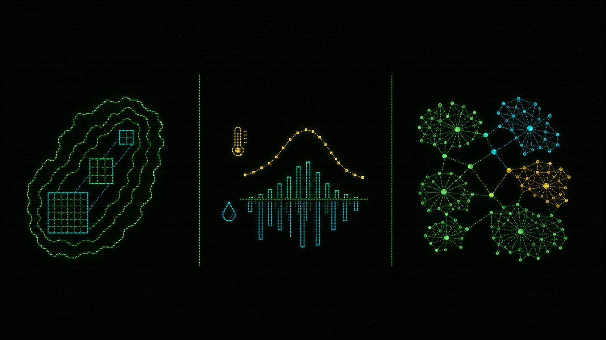
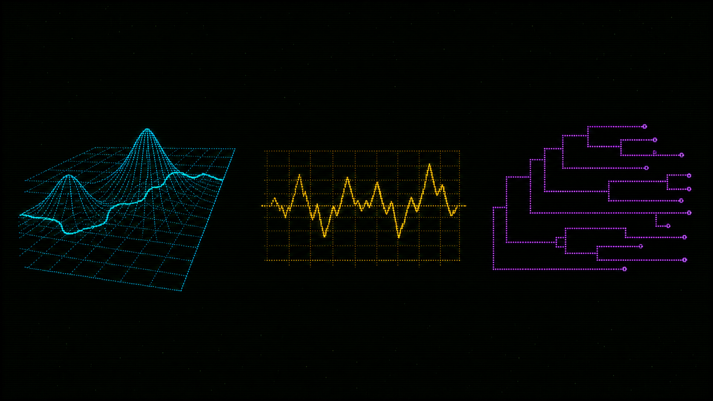
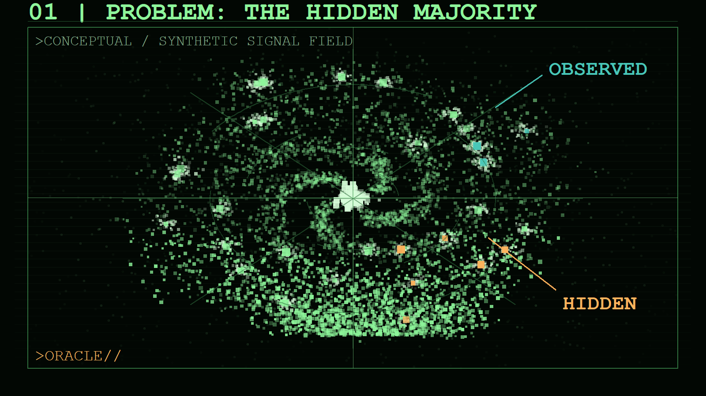
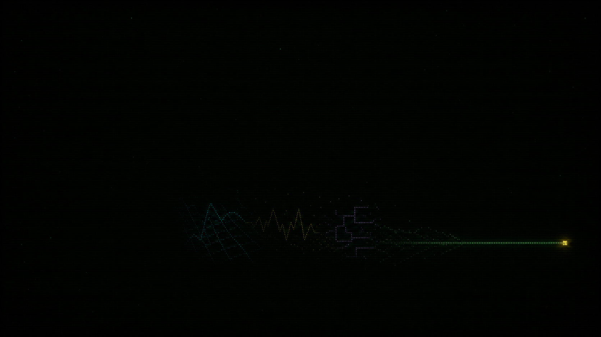

## BIODYNAMICS: ECOLOGICAL BIOSURVEILLANCE SYSTEM {.slide-title .screen-corners .screen-header .screen-prompt .screen-link-oracle}

<!-- slide:00 -->

:::: {.columns}
::: {.column .panel-line-left .padding-left-large .padding-top-small .padding-bottom-small width="80%"}

[talking to &lt;ORACLE&gt;:]{.display-block .text-weight-heading .text-line-height-title .margin-bottom-large .text-shadow-dim .text-uppercase .text-size-heading .text-color-cyan}

[Exploring biotic signals in vegetation assembly from the LGM to the Anthropocene]{.display-block .text-weight-heading .text-line-height-title .margin-bottom-large .text-uppercase .text-size-heading-large .text-color-green .text-shadow .text-line-under .padding-bottom-large}

 

[Ondrej Mottl]{.text-size-title .text-color-purple .text-bold }

[IAVS 2026 || 22-26 June 2026 || Gijón, Spain]{.text-size-title-small .text-color-amber}

:::

::: {.column width="20%"}
{.image-display-block .margin-x-auto .image-blend-screen .image-fit-contain .width-full .image-glow}
:::

::::

:::: {.columns .panel-line-top .margin-top-large .padding-top-small}

::: {.column width="33%"}
::: {.text-color-muted .text-letter-spacing-status .text-uppercase .text-strong-green .text-position-center}
NARRATIVE INTERFACE: **ORACLE**
:::
:::

::: {.column width="33%" .text-position-center .text-color-muted}
.../.../...
:::

::: {.column width="33%"}
::: {.text-color-muted .text-letter-spacing-status .text-uppercase .text-strong-green .text-position-center}
ANALYTICAL  OUTPUTS: **REAL**
:::
:::

::::

::: {.notes}
TIME 00:25. I will ask the audience to close their eyes and imagine there are on a space ship and their goal is to examine the vegtation patterns of this Planet called "Earth". We will use of the spaceship computer called ORACLE to do so. All the data, analysis, and results are real. The computer is not real and only serves as a narrative device.
:::

<!-- slide:01 -->
## System ... booting {.slide-terminal .slide-terminal-story}

:::: {.columns}
::: {.column width="50%" .fragment .tui-reveal}
{.image-display-block .margin-x-auto .image-height-750 .image-blend-screen .image-fit-contain .width-full}
:::

::: {.column width="50%" .fragment .tui-reveal}
::: {.oracle-says .terminal-cursor}
[System online.]{.oracle-line}
[Greetings Dr. Mottl.]{.oracle-line}
[I am **[O]bservational [R]untime for [A]nalysis of [C]ommunity-[L]evel [E]cology**]{.oracle-line}
[&lt;ORACLE&gt; for short.]{.oracle-line}
[I am here to assist you in analyzing vegetation patterns on Earth.]{.oracle-line}
[Awaiting ecological query.]{.oracle-line}
[ ]{.oracle-line}
[Proceed? Y/N?]{.oracle-line}
:::

:::
::::

 
 
 

:::: {.columns .margin-top-large .padding-top-small}

::: {.column width="33%"}
::: {.text-color-muted .text-letter-spacing-status .text-uppercase .text-strong-green .text-position-center}
BIOSPHERE DIVERSITY: **HIGH** 
:::
:::

::: {.column width="33%" .text-position-center .text-color-muted}
CHANGE: **ACCELERATING** 
:::

::: {.column width="33%"}
::: {.text-color-muted .text-letter-spacing-status .text-uppercase .text-strong-green .text-position-center}
UNCERTAINTY: **SUBSTANTIAL**
:::
:::

::::

::: {.notes}
TIME 00:35. Welcome fellow scientists, you may open your eyes! I am Ondřej Mottl, the chief researcher at this space station. We have 12 minutes to explore the vegetation patterns of a alian planet called 'Earth' using the ORACLE system. Let's get started. ORACLE, please boot up and introduce yourself.
:::

<!-- slide:02 -->
## Is there a [scale dependence]{.text-color-amber .text-bold} in the amount of unexplained variation ([potentially due to biotic interactions]{.text-color-cyan}) structuring vegetation? {.slide-terminal .slide-terminal-question}

:::: {.columns}
::: {.column width="65%" .fragment .tui-reveal data-fragment-index="2"}
{.image-display-block .margin-x-auto .image-height-story .image-blend-screen .image-fit-contain .width-full}
:::

::: {.column width="35%" .fragment .tui-reveal data-fragment-index="1"}
::: {.oracle-says}
[Query accepted.]{.oracle-line}
[Plan to partition observed plant co-occurrence into:]{.oracle-line} 
[ - spatial structure]{.oracle-line}
[ - climate response]{.oracle-line}
[ - residual species-species association.]{.oracle-line}
:::

:::
::::

::: {.notes}
TIME 00:45. Oracle, I would like like to explore vegation patterns across space and time of this planet. From our knowlege banks we know that vegetation is mostly explaineby climate and spatial factors. However, I am particullary interested in the unexplained variation. My first question is simple: Does the unexplained part of the community pattern change with scale, or does it stay broadly consistent?
:::

<!-- slide:03 -->
## Archive mounted: VegVault {.slide-terminal .slide-terminal-story}

:::: {.columns}
::: {.column width="62%"}
STORY SCHEMATIC

**Northern Hemisphere coverage**

North America / Europe / Asia

PHASE 5: ADD MAP OUTPUT
:::

::: {.column width="38%"}
::: {.oracle-says}
[VegVault database:]{.oracle-line}
[publicly available,]{.oracle-line}
[open source database.]{.oracle-line}
[VegVault scan complete.]{.oracle-line}
[Community records, climate]{.oracle-line}
[predictors,]{.oracle-line}
[site coordinates, and]{.oracle-line}
[functional traits]{.oracle-line}
[are loaded as separate streams.]{.oracle-line}
[Due to data availability,]{.oracle-line}
[I will focus on the]{.oracle-line}
[Northern Hemisphere of the planet.]{.oracle-line}
:::

SYSTEM SCHEMATIC

**Input streams**

Vegetation / pollen / climate / traits

PHASE 4 PLACEHOLDER
:::
::::

::: {.notes}
TIME 00:45. Oracle, Load the VegVault database to get vegetation data, climate predictors, and functional traits for our analysis.
The database is publicly available and open source. For this analysis, we will focus on the Northern Hemisphere of the planet, which includes North America, Europe, and Asia.
:::

<!-- slide:04 -->
## Three analysis axes {.slide-terminal .slide-terminal-methods}

:::: {.columns}
::: {.column width="65%"}
{.image-display-block .margin-x-auto .image-height-story .image-blend-screen .image-fit-contain .width-full}
:::

::: {.column width="35%"}
::: {.oracle-says}
[Route selected.]{.oracle-line}
[Spatial-resolution runs]{.oracle-line}
[test scale and taxonomic]{.oracle-line}
[aggregation level.]{.oracle-line}
[Temporal slices test]{.oracle-line}
[change through time.]{.oracle-line}
:::

::: {.text-color-muted .text-letter-spacing-status .text-uppercase .text-strong-green}
ROUTE SUMMARY
:::

- [Spatial]{.text-color-cyan}: local to continental units
- [Temporal]{.text-color-amber}: repeated palaeo slices
- [Taxonomic]{.text-color-purple}: genus, family, functional type

METHOD ILLUSTRATION / NOT A RESULT
:::
::::

::: {.notes}
TIME 00:35. Now, we would like to split the analysis along space (from local to continental), time (since the last glacial maximum), and taxonomic resolution (from genus up to abstract functional types).
:::

<!-- slide:05 -->
## Preparing community and climate streams {.slide-terminal .slide-terminal-methods}

:::: {.columns}
::: {.column width="35%"}
::: {.oracle-says}
[Data extracted,]{.oracle-line}
[now preparation ...]{.oracle-line}
[Community stream normalised.]{.oracle-line}
[Taxa are classified,]{.oracle-line}
[filtered, and routed to]{.oracle-line}
[the analysis resolution.]{.oracle-line}
[Climate stream screened.]{.oracle-line}
[Redundant predictors]{.oracle-line}
[are removed]{.oracle-line}
[before model fitting.]{.oracle-line}
:::

COMMUNITY STREAM

[01] Counts and ages 
[02] Proportions and alignment 
[03] Taxa classified and filtered 
[04] Model-ready community
:::

::: {.column width="65%"}
CLIMATE DIAGNOSTIC PLACEHOLDER

CHELSA predictor screening and collinearity panel

PHASE 5: INSERT VERIFIED OUTPUT
:::
::::

::: {.notes}
TIME 00:45. Walk through the processing logic rather than numbers. Stress that climate screening and community preparation occur before model fitting; diagnostics will be replaced with verified output in phase 5.
:::

<!-- slide:06 -->
## Model core: environment, space, association {.slide-terminal .slide-terminal-methods}

:::: {.columns}
::: {.column width="68%"}
:::: {.columns}
::: {.column width="22%"}
ABIOTIC

Climate predictors
:::
::: {.column width="22%"}
SPATIAL

MEM structure
:::
::: {.column width="22%"}
ASSOCIATION

Residual covariance
:::
::: {.column width="5%"}
->
:::
::: {.column width="22%"}
RESPONSE

Community matrix
:::
::::
:::

::: {.column width="32%"}
::: {.oracle-says}
[Model assembled.]{.oracle-line}
[Abiotic predictors explain]{.oracle-line}
[shared response.]{.oracle-line}
[Moran Eigenvector Maps (MEMs)]{.oracle-line}
[absorb spatio-temporal]{.oracle-line}
[autocorrelation.]{.oracle-line}
[Residual covariance carries]{.oracle-line}
[association signal.]{.oracle-line}
:::

CONCEPTUAL MODEL DIAGRAM / `sjSDM` IMPLEMENTATION CONTEXT
:::
::::

::: {.notes}
TIME 00:45. Introduce the model architecture: abiotic predictors, spatial structure, and remaining covariance. Do not claim that residual covariance alone demonstrates direct biotic interaction.
:::

<!-- slide:07 -->
## Variance decomposition {.slide-terminal .slide-terminal-methods}

:::: {.columns}
::: {.column width="60%"}
:::: {.columns}
::: {.column width="50%"}
Abiotic
:::
::: {.column width="50%"}
Spatial
:::
::::
:::: {.columns}
::: {.column width="50%"}
Association
:::
::: {.column width="50%"}
Shared fractions
:::
::::
:::

::: {.column width="40%"}
::: {.oracle-says}
[Decomposition ready.]{.oracle-line}
[Report what remains after climate]{.oracle-line}
[and spatial structure have made]{.oracle-line}
[their claims.]{.oracle-line}
:::

- Focus: residual association component
- Caution: co-occurrence is not proof of interaction

SCHEMATIC / NOT FITTED VALUES
:::
::::

::: {.notes}
TIME 00:40. Explain the decomposition as the bridge from model to question. Shared fractions are diagnostic; the talk follows the residual component cautiously.
:::

<!-- slide:08 -->
## Spatial scan: local to continental {.slide-terminal .slide-terminal-results}

:::: {.columns}
::: {.column width="36%"}
::: {.oracle-says}
[Spatial scan configured.]{.oracle-line}
[Units are nested from local to regional to continental.]{.oracle-line}
:::

::: {.fragment .tui-reveal data-fragment-index="1"}
MAP PLACEHOLDER

**Spatial units**

Example nested local, regional, and continental extents.

PHASE 5 OUTPUT
:::
:::

::: {.column .fragment .tui-reveal width="64%" data-fragment-index="2"}
RESULT PLACEHOLDER

**Association across spatial scales**

Tile layout reserved for unit-level residual association.

PROVISIONAL CLAIM ONLY
:::
::::

::: {.notes}
TIME 00:50. Set up the spatial comparison. The draft narrative expects no obvious monotonic change, but state that the plotted evidence is deliberately withheld until verified outputs are integrated.
:::

<!-- slide:09 -->
## Add taxonomic resolution {.slide-terminal .slide-terminal-question}

:::: {.columns}
::: {.column .fragment .tui-reveal width="68%" data-fragment-index="2"}
RESULT MATRIX PLACEHOLDER

**Spatial x taxonomic tile grid**

Nine-panel result layout reserved.

PHASE 5 OUTPUT
:::

::: {.column width="32%"}
::: {.oracle-says}
[Query accepted.]{.oracle-line}
[Adding taxonomic axis.]{.oracle-line}
[Plotting the results.]{.oracle-line}
:::

EXPECTED TEST

Will aggregation alter the visibility of association-like signal?

::: {.fragment}
Three spatial scales x three taxonomic routes
:::
:::
::::

::: {.notes}
TIME 00:45. Introduce the second comparison axis. The slide prepares the expectation and layout; avoid stating the outcome until the matrix is backed by verified outputs.
:::

<!-- slide:10 -->
## Temporal mode: repeated slices {.slide-terminal .slide-terminal-question}

:::: {.columns}
::: {.column width="35%"}
::: {.oracle-says}
[Query accepted.]{.oracle-line}
[Temporal mode selected. Slicing the data into 500-year windows.]{.oracle-line}
[Network diagnostics loaded. Co-occurrence structure can change]{.oracle-line}
[even when variance components look similar.]{.oracle-line}
[Each slice receives an independent analysis and diagnostics.]{.oracle-line}
[Plotting the results.]{.oracle-line}
[Proceed? Y/N?]{.oracle-line}
:::
:::

::: {.column .fragment .tui-reveal width="65%" data-fragment-index="1"}
TEMPORAL DIAGNOSTIC FIGURE PLACEHOLDER

**Composite time-mode display**

Data density / network snapshot / repeated model slices

PHASE 5: INSERT VERIFIED MULTIPANEL OUTPUT
:::
::::

::: {.notes}
TIME 00:50. Move from spatial comparisons to temporal stress testing. Explain that data coverage, network structure, and model components need to be assessed together.
:::

<!-- slide:11 -->
## Temporal trajectories {.slide-terminal .slide-terminal-results}

::: {.oracle-says}
[Plotting temporal trajectories.]{.oracle-line}
:::

:::: {.columns}
::: {.column .fragment .tui-reveal width="33.33%" data-fragment-index="1"}
NORTH AMERICA

Trajectory and network panel

PHASE 5 OUTPUT
:::
::: {.column .fragment .tui-reveal width="33.33%" data-fragment-index="2"}
EUROPE

Trajectory and network panel

PHASE 5 OUTPUT
:::
::: {.column .fragment .tui-reveal width="33.33%" data-fragment-index="3"}
ASIA

Trajectory and network panel

PHASE 5 OUTPUT
:::
::::

::: {.notes}
TIME 00:50. Describe the intended regional comparison without reporting changes through time yet. Verified temporal figures will determine the final wording.
:::

<!-- slide:12 -->
## Synthesis pending verification {.slide-terminal .slide-terminal-synthesis}

::: {.oracle-says}
[Weaving realities together: spatial patterns, taxonomic resolution, temporal dynamics.]{.oracle-line}
[Consulting deeper reasoning matrices.]{.oracle-line}
[Summarizing results.]{.oracle-line}
:::

::: {.fragment .tui-reveal data-fragment-index="1"}
[SPACE]{.text-color-cyan} 
Local to continental comparison.

[TAXONOMY]{.text-color-purple} 
Genus / family / functional-type comparison.

[TIME]{.text-color-amber} 
Palaeo trajectory and network comparison.
:::

::: {.fragment .tui-reveal data-fragment-index="2"}
PROVISIONAL - VERIFY IN PHASE 5 BEFORE CITATION
:::

::: {.notes}
TIME 00:45. This is the narrative landing point for the result sequence. During phase 4, read it as the planned synthesis structure, not as completed inference.
:::

<!-- slide:13 -->
## Implication: visible patterns are only part of the signal {.slide-terminal .slide-terminal-synthesis}

:::: {.columns}
::: {.column .fragment .tui-reveal width="65%" data-fragment-index="1"}
{.image-display-block .margin-x-auto .image-height-story .image-blend-screen .image-fit-contain .width-full}
:::

::: {.column width="35%"}
::: {.oracle-says}
[Association-like structure can persist]{.oracle-line}
[after the most obvious environmental]{.oracle-line}
[and spatial patterns are accounted]{.oracle-line}
[for.]{.oracle-line}
:::

- Ask what remains, rather than naming an interaction.
- Treat residual structure as a constrained inference.

SYNTHETIC R-GENERATED CONCEPT / NOT A RESULT
:::
::::

::: {.notes}
TIME 00:40. Use this conceptual image to explain why the residual question matters, while explicitly separating narrative illustration from empirical results.
:::

<!-- slide:14 -->
## Query resolved, cautiously {.slide-terminal .slide-terminal-synthesis}

:::: {.columns}
::: {.column width="32%"}
::: {.oracle-says .terminal-cursor}
[The archive narrows plausible]{.oracle-line}
[ecological explanations.]{.oracle-line}
[It does not replace]{.oracle-line}
[verification.]{.oracle-line}
:::

::: {.text-color-muted .text-letter-spacing-status .text-uppercase .text-strong-green}
SIGNAL STATUS: **PENDING VERIFIED FIGURE INTEGRATION**
:::
:::

::: {.column width="68%"}
{.image-display-block .margin-x-auto .image-height-story .image-blend-screen .image-fit-contain .width-full}
:::
::::

::: {.notes}
TIME 00:20. Close the ORACLE query narrative before moving to practical closing information. Keep the conclusion explicitly cautious.
:::

<!-- slide:15 -->
## Who is asking the query? {.slide-terminal .slide-terminal-story}

:::: {.columns}
::: {.column width="50%"}
PRESENTER

**Ondrej Mottl**

BIODYNAMICS vegetation co-occurrence 
IAVS 2026
:::

::: {.column width="50%"}
RESEARCH CONTEXT

Plant-community structure across spatial, temporal, and taxonomic scales.

::: {.text-color-muted .text-letter-spacing-status .text-uppercase .text-strong-green}
COLLABORATORS / AFFILIATIONS: FINALIZE BEFORE DELIVERY
:::
:::
::::

::: {.notes}
TIME 00:20. Briefly identify the research context and leave the detailed acknowledgment block for final delivery preparation.
:::

<!-- slide:16 -->
## Presentation availability {.slide-terminal .slide-terminal-story}

:::: {.columns}
::: {.column width="38%"}
PUBLIC URL

**Rendered presentation**

Project GitHub Pages link to be inserted.

PHASE 8 DELIVERY ITEM
:::

::: {.column width="62%"}
QR CODE

**Slides, code, and VegVault**

QR and DOI target reserved for final access page.

PHASE 8 DELIVERY ITEM
:::
::::

::: {.text-color-muted .text-letter-spacing-status .text-uppercase .text-strong-green}
LICENCE TEXT AND FINAL DEPLOYMENT ADDRESS TO BE CONFIRMED BEFORE RELEASE
:::

::: {.notes}
TIME 00:25. Signal that the presentation and analysis code will be available, while leaving final URLs and licence wording to delivery preparation.
:::

<!-- slide:17 -->
## Vegetation co-occurrence across scale {.slide-title .screen-corners .screen-header .screen-prompt .screen-link-oracle}

:::: {.columns .panel-line-top .margin-top-large .padding-top-small}
::: {.column .panel-line-left .padding-left-large .padding-top-small .padding-bottom-small width="45%"}
[QUERY CLOSED // DISCUSSION OPEN]{.display-block .text-color-amber .text-size-kicker .margin-bottom-md}

**ORACLE**

Observational Runtime for Analysis of Community-Level Ecology

Ondrej Mottl 
BIODYNAMICS vegetation co-occurrence 
Contact and repository URL: final delivery placeholder

::: {.text-color-amber .text-bold .margin-top-large .terminal-cursor}
ORACLE > AWAITING QUESTIONS
:::
:::

::: {.column width="55%"}
{.image-display-block .margin-x-auto .image-height-story .image-blend-screen .image-fit-contain .width-full .image-glow .image-scale-large}
:::
::::

::: {.notes}
TIME 00:25. End on the same Earth-archive visual used at the opening and invite questions. Planned main-talk duration: 11 minutes 25 seconds.
:::
