```{r}
#| label: setup
#| include: false
library(here)
here::i_am("Documentation/Presentations/IAVS_2026/index.qmd")

source(
  here::here("R/___setup_project___.R")
)

list_oracle_design <-
  load_design_config(
    path = here::here(
      "Documentation",
      "Presentations",
      "IAVS_2026",
      "design_config.json"
    )
  )

vec_oracle_palette <-
  list_oracle_design |>
  purrr::chuck(
    "config",
    "palette"
  )

make_gif_poster <- function(file_name) {
  path_gif <-
    here::here(
      "Documentation",
      "Presentations",
      "IAVS_2026",
      "figures",
      "results",
      file_name
    )

  path_poster <-
    stringr::str_replace(
      string = path_gif,
      pattern = "[.]gif$",
      replacement = "_poster.png"
    )

  vec_frames <-
    magick::image_read(path = path_gif)

  magick::image_write(
    image = vec_frames[base::length(vec_frames)],
    path = path_poster
  )

  path_poster
}

```

## BIODYNAMICS PROJECT {.slide-title .slide-planet-bg .screen-corners .screen-header .screen-prompt .screen-link-oracle}

<!-- slide:00 -->

::: {.planet-scanlines}
:::

:::: {.columns}
::: {.column .panel-line-left .padding-left-large .padding-top-small .padding-bottom-small width="100%"}

[talking to \<ORACLE\>:]{.display-block .text-weight-heading .text-line-height-title .margin-bottom-large .text-shadow-dim .text-uppercase .text-size-heading .text-color-cyan}

[Exploring biotic signals in vegetation assembly from the LGM to the Anthropocene]{.display-block .text-weight-heading .text-line-height-title .margin-bottom-large .text-uppercase .text-size-heading-large .text-color-green .text-shadow .text-line-under .padding-bottom-large}

<br>
<br>

[Ondrej Mottl]{.text-size-title .text-color-purple}

[IAVS 2026 || 22-26 June 2026 || Gijón, Spain]{.text-size-title-small .text-color-amber}

<br>
<br>
<br>

:::

::::

:::: {.columns .panel-line-top .margin-top-large .padding-top-small}

::: {.column width="33%"}
::: {.text-color-muted .text-letter-spacing-status .text-uppercase .text-position-center}
NARRATIVE INTERFACE: **ORACLE**
:::
:::

::: {.column width="33%" .text-position-center .text-color-muted}
.../.../...
:::

::: {.column width="33%"}
::: {.text-color-muted .text-letter-spacing-status .text-uppercase .text-position-center}
ANALYTICAL  OUTPUTS: **REAL**
:::
:::

::::

::: {.notes}
Hello and welcome to my talk! I would like to try something different. I think that science should be serious but also a little bit fun. So I decided to do something unusual. I will ask the audience to close their eyes and imagine that we are on a spaceship and our goal is to examine the vegetation patterns of this weird planet called "Earth". We will use the spaceship's supercomputer, ORACLE, to do so. All the data, analyses, and results you will see are real. BUT the supercomputer is NOT real and only serves as a narrative device.
:::

<!-- slide:01 -->
## [... booting]{.fragment .fragment-terminal data-fragment-index="0"} {.slide-terminal .slide-terminal-story}

:::: {.columns}
::: {.column width="50%" .fragment .tui-reveal-scan}
{.image-display-block .margin-x-auto .image-height-750 .image-blend-screen .image-fit-contain .width-full}
:::

::: {.column width="50%" .fragment}
::: {.oracle-terminal}

::: {.oracle-line}
[System online]{.text-emphasis-chip}
:::

[]{.oracle-line}

::: {.oracle-line}
Greetings Dr. Mottl
:::

[]{.oracle-line}

::: {.oracle-line}
I am [O]{.text-emphasis-underline}bservational [R]{.text-emphasis-underline}untime for [A]{.text-emphasis-underline}nalysis of [C]{.text-emphasis-underline}ommunity-[L]{.text-emphasis-underline}evel [E]{.text-emphasis-underline}cology
:::

::: {.oracle-line}
[\<ORACLE\>]{.text-emphasis-chip .text-emphasis-underline-double} for short
:::

[]{.oracle-line}

::: {.oracle-line}
I am here to assist you in analyzing vegetation patterns on Earth
:::

[]{.oracle-line}

::: {.oracle-line}
[Awaiting ecological query.]{.text-emphasis-chip}
:::

[]{.oracle-line}

[]{.oracle-line}

::: {.oracle-line}
Proceed? [Y]/[N]?
:::
:::

:::
::::

::: {.notes}
Welcome, fellow scientists, you may open your eyes! I am Ondřej Mottl, the chief researcher at this space station. We have around 13 minutes to use a supercomputer called the Observational Runtime for Analysis of Community-Level Ecology (ORACLE) to explore the vegetation patterns of this weird planet called 'Earth'. ORACLE has already introduced itself, so let's get started.
:::

<!-- slide:02a -->
## {.slide-terminal .slide-terminal-question}

<br>
<br>
<br>

::: {.text-size-heading-large .text-weight-heading .text-line-height-title .margin-bottom-large .text-shadow-dim .text-emphasis-box .text-position-center}

[Is there a [scale dependence]{.text-bold .text-color-spatial .text-emphasis-underline} in the amount of [unexplained variation]{.text-emphasis-underline-dotted} (potentially due to [biotic interactions]{.text-color-latent}) structuring vegetation since [LGM]{.text-emphasis-underline-dotted}?]{.text-size-heading-large .fragment}

:::

:::{.notes}
The main question of this talk is: Is there a scale dependence in the amount of unexplained variation structuring vegetation since the Last Glacial Maximum (LGM)?
I am personally interested in understanding the processes that structure vegetation patterns on Earth. We know that climate and spatial factors play a big role, but I am particularly interested in the unexplained variation, which could potentially be attributed to biotic interactions. These interactions can take the form of shared pollinator or herbivore pressure, or direct facilitation or competition between plants.
We would assume that the amount of unexplained variation would change with scale; for example, biotic interactions can be more likely to be detected at local scales than at continental scales.
:::

<!-- slide:02 -->
## [Is there a [scale dependence]{.text-bold .text-emphasis-underline} in the amount of [unexplained variation]{.text-emphasis-underline-dotted} (potentially due to [biotic interactions]{.text-color-latent}) structuring vegetation since [LGM]{.text-emphasis-underline-dotted}?]{.fragment .fragment-terminal data-fragment-index="0"} {.slide-terminal .slide-terminal-question}

:::: {.columns}

::: {.column width="35%" .fragment data-fragment-index="1"}

<br>
<br>
<br>

::: {.oracle-terminal}

::: {.oracle-line}
Query accepted
:::

[]{.oracle-line}

::: {.oracle-line}
Plan to [partition]{.text-emphasis-underline} observed plant co-occurrence into:
:::

[]{.oracle-line}

::: {.oracle-line}
[spatial]{.text-highlight-spatial} structure
:::

::: {.oracle-line}
[climate]{.text-highlight-abiotic} response
:::

::: {.oracle-line}
[species-species association]{.text-highlight-latent} (residual)
:::
:::

:::

::: {.column width="21%" .fragment .tui-reveal-scan data-fragment-index="2"}
{.image-display-block .margin-x-auto .image-blend-screen .image-fit-contain .width-full .image-height-750}
:::

::: {.column width="21%" .fragment .tui-reveal-scan data-fragment-index="3"}
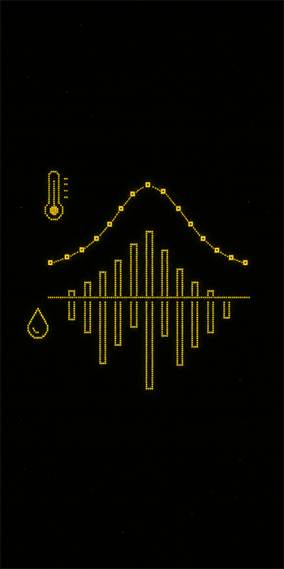{.image-display-block .margin-x-auto .image-blend-screen .image-fit-contain .width-full .image-height-750}
:::

::: {.column width="21%" .fragment .tui-reveal-scan data-fragment-index="4"}
{.image-display-block .margin-x-auto .image-blend-screen .image-fit-contain .width-full .image-height-750}
:::

::::

::: {.notes}
So ORACLE, is there a scale dependence in the amount of unexplained variation structuring vegetation since the Last Glacial Maximum (LGM)? ORACLE suggests that we could partition the observed plant co-occurrence into three components: spatial structure, or spatial autocorrelation, which will always be in blue; climate response, such as temperature or precipitation, which will be in yellow; and residual species-species association, which will be in purple.
:::

<!-- slide:03 -->
## [DATA: [\<VegVault\>]{.text-emphasis-chip}]{.fragment .fragment-terminal data-fragment-index="0"} {.slide-terminal .slide-terminal-methods}

```{r}
#| label: result-slide03-generate
#| include: false
#| cache: true
source(
  here::here(
    "Documentation/Presentations/IAVS_2026/R/Visualisation/Data_ingestion_schematic_figure.R"
  )
)

source(
  here::here(
    "Documentation/Presentations/IAVS_2026/R/Visualisation/northern_hemisphere_coverage_figure.R"
  )
)
```

:::: {.columns}

::: {.column width="0%"}
:::

::: {.column width="50%" }

::: {.fragment .tui-reveal-blur data-fragment-index="2"}

```{r}
#| label: result-slide03-ingestion-build
#| echo: false
#| warning: false
#| message: false
#| include: true
#| cache: true
source(
  here::here(
    "Documentation/Presentations/IAVS_2026/R/Visualisation/Data_ingestion_schematic_figure.R"
  )
)
```

```{r}
#| label: result-slide03-ingestion-render
#| echo: false
#| out-width: 95%
knitr::include_graphics(
  here::here(
    "Documentation/Presentations/IAVS_2026/figures/results/slide_03_ingestion_schematic.png"
  )
)
```

:::

::: {.fragment .tui-reveal-blur data-fragment-index="3"}

USED SAMPLE COVERAGE

```{r}
#| label: result-slide03-coverage-build
#| echo: false
#| warning: false
#| message: false
#| include: true
#| cache: true
source(
  here::here(
    "Documentation/Presentations/IAVS_2026/R/Visualisation/northern_hemisphere_coverage_figure.R"
  )
)
```

```{r}
#| label: result-slide03-coverage-render
#| echo: false
#| out-width: 95%
knitr::include_graphics(
  here::here(
    "Documentation/Presentations/IAVS_2026/figures/results/slide_03_northern_hemisphere_coverage.png"
  )
)
```

:::

:::

::: {.column width="50%" }
::: {.oracle-terminal .fragment data-fragment-index="1"}

::: {.oracle-line}
[\<VegVault\>]{.text-emphasis-chip} database: publicly available, open-source database
:::

[]{.oracle-line}

::: {.oracle-line}
[Community records]{.text-emphasis-box}, [climate predictors]{.text-color-abiotic}, [site coordinates]{.text-color-spatial}, and [functional traits]{.text-color-latent} are loaded as separate streams
:::

[]{.oracle-line}

::: {.oracle-line}
Due to [data availability]{.text-emphasis-underline-dotted}, I will focus on the [Northern Hemisphere]{.text-emphasis-underline-double} of the planet since the [LGM]{.text-emphasis-underline-double}
:::
:::

::: {.fragment .tui-reveal-scan data-fragment-index="4"}

:::: {.columns .image-height-750}

::: {.column width="50%"}
{.absolute .image-display-block .image-theme-bg-dark top=0 left=50 width="300" height="300"}
:::

::: {.column width="50%"}
```{r}
#| label: QR code https://bit.ly/VegVault 
#| echo: false
#| eval: true
#| output: false
#| cache: true
generate_qr_code(
  url = "https://bit.ly/VegVault",
  name = "vegvault",
  background_color = vec_oracle_palette[["background"]],
  foreground_color = vec_oracle_palette[["phosphor"]],
  plot = FALSE
)
```

{.absolute .image-display-block top=0 right=0 width="300" height="300"}
:::

::::

:::

:::
::::

::: {.notes}
We will be using the VegVault database, which is a publicly available and open-source meta-database that combines various data sources, such as vegetation plots, fossil pollen records, contemporary and palaeoclimate data, and functional traits.
The database is global but, for this project, we will focus on the Northern Hemisphere. As you can see in the figure, the data coverage is particularly strong in North America and Europe, but we will also include Asia.
I have presented the database last year at the IAVS 2025 conference, and there is now also a paper in Nature Scientific Data.
If you would like to find out more about the database, you can scan the QR code on the right.
:::

<!-- slide:04 -->
## [Preparing [community]{.text-emphasis-box} and [climate]{.text-highlight-abiotic} streams]{.fragment .fragment-terminal data-fragment-index="0"} {.slide-terminal .slide-terminal-methods}


:::: {.columns}

::: {.column width="40%"}

<br>

::: {.oracle-terminal .fragment data-fragment-index="1"}

::: {.oracle-line}
Data extracted, now [preparing]{.text-emphasis-underline-dotted} ...
:::

[]{.oracle-line}

::: {.oracle-line}
[[Community]{.text-emphasis-box} stream normalised]{.text-emphasis-underline}
:::

::: {.oracle-line}
 - proportions filtered
:::

::: {.oracle-line}
 - Taxa are classified [automatically]{.text-emphasis-underline-dotted} against GBIF and filtered
:::

::: {.oracle-line}
 - [Age uncertainty]{.text-highlight-temporal} [propagated]{.text-emphasis-underline-dotted} to estimate counts
:::


[]{.oracle-line}

::: {.oracle-line}
[[Climate]{.text-highlight-abiotic} stream screened]{.text-emphasis-underline}
:::

::: {.oracle-line}
 - [Redundant]{.text-emphasis-underline-dotted} predictors are [removed]{.text-emphasis-underline-dotted} before model fitting
:::
:::


:::

::: {.column width="5%"}
:::

::: {.column width="60%" .fragment .tui-reveal-blur data-fragment-index="2" }

```{r}
#| label: result-slide05-workflow-build
#| echo: false
#| warning: false
#| message: false
#| include: true
#| cache: true
#| eval: true
source(
  here::here(
    "Documentation/Presentations/IAVS_2026/R/Visualisation/climate_data_summary_figure.R"
  )
)
```

```{r}
#| label: result-slide05-workflow-render
#| echo: false
#| out-width: 90%
#| eval: true
knitr::include_graphics(
  here::here(
    "Documentation/Presentations/IAVS_2026/figures/results/slide_05_climate_screening.png"
  )
)
```

<!-- Let's keep the mermaid as backup -->

::: {.oracle-mermaid .oracle-mermaid-process}

```{mermaid}
%%| label: slide05-community-climate-mermaid
%%| eval: false
%%{init: {
  "theme": "base",
  "flowchart": {
    "curve": "basis",
    "htmlLabels": true,
    "nodeSpacing": 22,
    "rankSpacing": 14,
    "padding": 10
  }
}}%%
flowchart TB
  source["VegVault"]

  subgraph community_stream [" "]
    direction TB
    community_title["COMMUNITY STREAM"]
    community_counts["counts<br/>proportions"]
    community_age["interpolation<br/>with uncertainty"]
    community_taxa["taxonomy<br/>harmonisation"]
    community_filters["Select<br/>resolution"]
    community_title ~~~ community_counts
    community_counts --> community_age --> community_taxa --> community_filters
  end

  subgraph climate_stream [" "]
    direction TB
    climate_title["CLIMATE STREAM"]
    climate_vars["CHELSA<br/>candidates"]
    climate_variance["drop invariant<br/>predictors"]
    climate_screen["select<br/>non-collinear set"]
    climate_grid["interpolate"]
    climate_title ~~~ climate_vars
    climate_vars --> climate_variance --> climate_screen --> climate_grid
  end

  sample_filtering["Sample filtering<br/>spatial/temporal"]
  core_filtering["Core filtering"]

  model["Model"]

  source --> community_counts
  source --> climate_vars
  community_filters --> sample_filtering
  climate_grid --> sample_filtering

  sample_filtering --> core_filtering

  core_filtering --> model


  class source,sample_filtering,core_filtering source_node
  class community_title community_title_node
  class climate_title climate_title_node
  class community_counts,community_age,community_taxa,community_filters community_node
  class climate_vars,climate_variance,climate_screen,climate_grid climate_node
  class model model_node
```

:::


:::
::::

::: {.notes}
Now we need to process the data. I am only mentioning a small subset of the processing pipeline, and it is much more complicated in reality. For the fossil pollen community data, we need to transform pollen counts to proportions. Then we interpolate to an even temporal spacing of 500 years, propagating age uncertainty from the age-depth models. We will harmonise the taxonomy to align with the GBIF backbone. This will allow us to select the taxonomic resolution, like genus or family, used to aggregate the data.
For the climate data, I used CHELSA bioclimatic variables, such as temperature, precipitation, and their variability. We remove all constant predictors, then check the correlation among them to create a non-collinear set. Finally, we interpolate to 500 years.
All data are then filtered to make sure we have enough samples and cores for the modelling.
:::

<!-- slide:05 -->
## [Model core: [environment]{.text-color-abiotic}, [space]{.text-color-spatial}, [association]{.text-color-latent}]{.fragment .fragment-terminal data-fragment-index="0"} {.slide-terminal .slide-terminal-methods}

:::: {.columns}

::: {.column width="10%"}
:::

::: {.column width="45%"}

<br>
<br>

::: {.text-equation .text-size-heading-small}

[$Y_{ij} \sim \operatorname{Bernoulli}\!\left\{\Phi\!\left(\eta_{ij}\right)\right\}$]{.text-equation-line .fragment data-fragment-index="2"}

<br>

::: {.text-equation-linear-predictor}
::: {.text-equation-row .fragment data-fragment-index="3"}
[$\eta_{ij} = \alpha_j \;+\;$]{.text-equation-base}
:::

::: {.text-equation-row .fragment data-fragment-index="4"}
[$\sum_{k=1}^{K}\,\beta_{jk}\,x_{ik} \;+\; \sum_{k=1}^{K}\,\gamma_{jk}\,x_{ik}\,a_i$]{.text-color-abiotic .text-equation-continuation}
[$\;+\;$]{.text-equation-base}
:::

::: {.text-equation-row .fragment data-fragment-index="5"}
[$\sum_{m=1}^{M}\,\delta_{jm}\,\operatorname{MEM}_{im}$]{.text-color-spatial .text-equation-continuation}
[$\;+\;$]{.text-equation-base}
:::

::: {.text-equation-row .fragment data-fragment-index="6"}
[$u_{ij}$]{.text-color-latent .text-equation-continuation}
:::
:::

<br>

::: {.fragment data-fragment-index="7"}
[$\mathbf{u}_i = (u_{i1}, \ldots, u_{iJ}) \sim \mathcal{N}(\mathbf{0}, \Sigma)$]{.text-color-latent .text-equation-line}
:::
:::

:::

::: {.column width="35%" .fragment data-fragment-index="1"}

::: {.oracle-terminal}

::: {.oracle-line}
[Model assembled.]{.text-emphasis-chip}
:::

[]{.oracle-line}

::: {.oracle-line}
[\{sjSDM\}]{.text-emphasis-underline-double} as the modeling framework
:::

[]{.oracle-line}

::: {.oracle-line}
[Abiotic predictors]{.text-highlight-abiotic} explain shared response
:::

[]{.oracle-line}

::: {.oracle-line}
[Moran Eigenvector Maps]{.text-highlight-spatial} (MEMs) absorb spatio-temporal autocorrelation
:::

[]{.oracle-line}

::: {.oracle-line}
[Residual covariance]{.text-highlight-latent} carries species-species association signal
:::

:::
:::
::::

::: {.text-equation-meta .text-size-body .fragment data-fragment-index="8"}
[Env]{.text-highlight-abiotic}[: `~ (x1 + ... + xK) * age - age`]{.text-color-abiotic}

[Space]{.text-highlight-spatial}[: `~ 0 + (MEM1 + ... + MEMM)`]{.text-color-spatial}

[Association]{.text-highlight-latent}[: off-diagonal `Sigma` from `sjSDM::bioticStruct()`]{.text-color-latent}
:::

::: {.notes}
Speaking of the model, we will be using the scalable joint Species Distribution Model, which is a variant of a joint species distribution model that is designed to run on graphics cards for very large datasets. It is also a probabilistic Bayesian model.
Now get ready for some math. The model is a Bernoulli model, which means presence-absence. We include the intercept; the abiotic predictors, which are the interaction of climate with time, as we assume that the relationship may change over time; the spatial predictors, represented by Moran Eigenvector Maps, to absorb spatio-temporal autocorrelation, as we assume that it is more likely to find similar taxa close in space and time; and the residual species-species association signal.
:::

<!-- slide:06 -->
## [Variance decomposition]{.fragment .fragment-terminal data-fragment-index="0"} {.slide-terminal .slide-terminal-methods}

:::: {.columns}

::: {.column width="50%" .fragment data-fragment-index="1"}

<br>
<br>
<br>
<br>

::: {.oracle-terminal}

::: {.oracle-line}
Decomposition ready
:::

[]{.oracle-line}

::: {.oracle-line}
Focus: [residual association component]{.text-highlight-latent}
:::

[]{.oracle-line}

::: {.oracle-line}
Report what remains after [climate]{.text-highlight-abiotic} and [spatial structure]{.text-highlight-spatial} have made their claims
:::

[]{.oracle-line}

::: {.oracle-line}
[Caution]{.text-highlight-warning}: co-occurrence is not proof of [interaction]{.text-color-warning}.
:::

:::
:::

::: {.column width="50%"} 

<br>

::: {.fragment .tui-reveal-blur data-fragment-index="2"}
```{r}
#| label: result-slide06-decomposition-build
#| echo: false
#| warning: false
#| message: false
#| include: true
#| cache: true
#| eval: true
source(
  here::here(
    "Documentation/Presentations/IAVS_2026/R/Visualisation/variance_decomposition_triangle_figure.R"
  )
)

source(
  here::here(
    "Documentation/Presentations/IAVS_2026/R/Visualisation/variance_decomposition_example_figure.R"
  )
)
```

```{r}
#| label: result-slide06-decomposition-render
#| echo: false
#| out-width: 90%
#| eval: true
knitr::include_graphics(
  here::here(
    "Documentation/Presentations/IAVS_2026/figures/results/slide_06_variance_decomposition.png"
  )
)
```

:::

:::: {.columns}

::: {.column width="70%" .fragment .tui-reveal-blur data-fragment-index="3"}
```{r}
#| label: result-slide06-component-stack-render
#| echo: false
#| out-width: 90%
#| eval: true
knitr::include_graphics(
  here::here(
    "Documentation/Presentations/IAVS_2026/figures/results/slide_06_component_stack_example.png"
  )
)
```

:::

::: {.column width="30%" .fragment .tui-reveal-blur data-fragment-index="4"}
```{r}
#| label: result-slide06-component-point-render
#| echo: false
#| out-width: 50%
#| eval: true
knitr::include_graphics(
  here::here(
    "Documentation/Presentations/IAVS_2026/figures/results/slide_06_component_point_example.png"
  )
)
```

:::

::::

:::

::::

::: {.notes}
Now that the model fits and converges, we would like to decompose the explained variance. We will focus on the latent residual species-species association, but we do have information about climate and space.
In this example model, the variance decomposition shows that 60% is abiotic/climate, roughly 30% is spatial, and 10% is residual association.
For each model, we have each of these numbers, but we can also combine them into a single color by placing them on this color triangle. The color of the point represents the relative contribution of each component to the total explained variance. The more purple, the more residual association is present in the model.
:::

<!-- slide:07 -->
## [Three analysis axes]{.fragment .fragment-terminal data-fragment-index="0"} {.slide-terminal .slide-terminal-methods}

<br>

:::: {.columns}

::: {.column width="33%" .text-position-center .fragment .tui-reveal-scan data-fragment-index="2"}

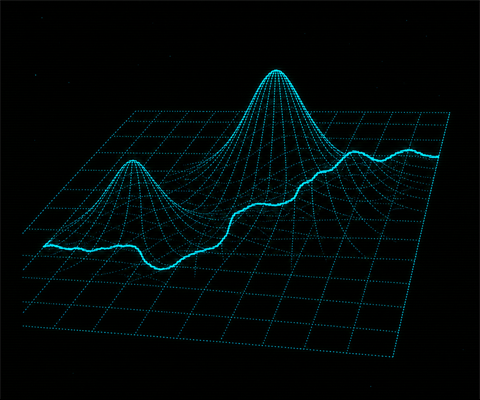{.image-display-block .margin-x-auto .image-blend-screen .image-fit-contain .width-full .image-height-400}

[Spatial]{.text-highlight-spatial}

:::

::: {.column width="33%" .text-position-center .fragment .tui-reveal-scan data-fragment-index="3"}

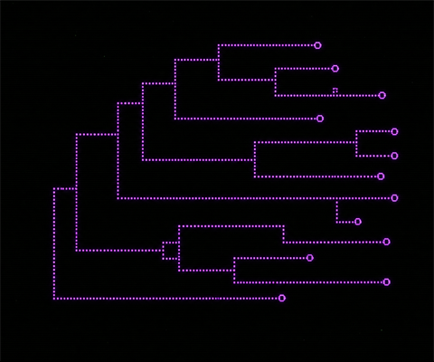{.image-display-block .margin-x-auto .image-blend-screen .image-fit-contain .width-full .image-height-400}

[Taxonomic]{.text-highlight-latent}

:::

::: {.column width="33%" .text-position-center .fragment .tui-reveal-scan data-fragment-index="4"}

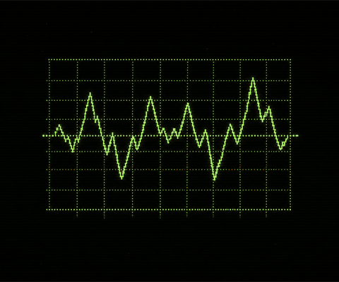{.image-display-block .margin-x-auto .image-blend-screen .image-fit-contain .width-full .image-height-400}

[Temporal]{.text-highlight-temporal}

:::

::::

<br>

::: {.oracle-terminal .fragment data-fragment-index="1"}

::: {.oracle-line}
Three routes selected:
:::

::: {.oracle-line}
[Spatial-resolution runs]{.text-highlight-spatial} : change with spatial scale
:::

::: {.oracle-line}
[Taxonomic aggregation levels]{.text-highlight-latent} : change through classification
:::

::: {.oracle-line}
[Temporal slice tests]{.text-highlight-temporal} : change through time
:::
:::

::: {.notes}
We use three axes to split the analysis. We will start with spatial scale - going from local to continental; taxonomic scale - how does the result change if we alter the taxonomic resolution; and temporal scale - is the signal changing from the Last Glacial Maximum to now?
:::

<!-- slide:08a -->

## {.slide-terminal .slide-terminal-story .slide-section-break}

<pre class="fragment section-break-ascii text-color-spatial" data-fragment-index="0" aria-label="Spatial scale">
▄█████ ▄▄▄▄   ▄▄▄ ▄▄▄▄▄▄ ▄▄  ▄▄▄  ▄▄       ▄▄▄▄  ▄▄▄▄  ▄▄▄  ▄▄    ▄▄▄▄▄
▀▀▀▄▄▄ ██▄█▀ ██▀██  ██   ██ ██▀██ ██      ███▄▄ ██▀▀▀ ██▀██ ██    ██▄▄
█████▀ ██    ██▀██  ██   ██ ██▀██ ██▄▄▄   ▄▄██▀ ▀████ ██▀██ ██▄▄▄ ██▄▄▄
</pre>

:::{.notes}
Now let's start with the spatial axis.
:::


<!-- slide:08 -->
## [[Spatial results]{.text-color-spatial}: local to continental]{.fragment .fragment-terminal data-fragment-index="0"} {.slide-terminal .slide-terminal-results}

```{r}
#| label: result-slide08-generate
#| include: false
#| cache: true
#| eval: false
source(
  here::here(
    "Documentation/Presentations/IAVS_2026/R/Visualisation/spatial_units_map_figure.R"
  )
)

source(
  here::here(
    "Documentation/Presentations/IAVS_2026/R/Visualisation/spatial_association_tiles_figure.R"
  )
)
```

```{r}
#| label: result-slide08-posters
#| include: false
make_gif_poster("slide_08_spatial_units_map.gif")
```

:::: {.columns}
::: {.column width="50%"}

::: {.fragment .tui-reveal-blur data-fragment-index="2"}

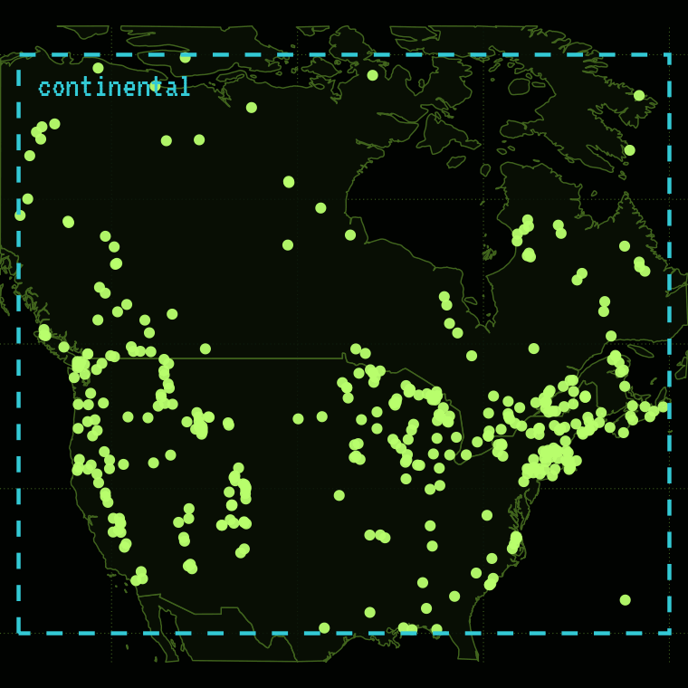{.gif-animated width="100%"}
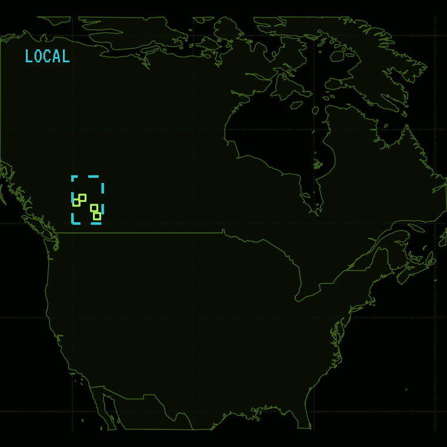{.gif-poster width="100%"}

:::

:::

::: {.column width="50%"}
::: {.fragment .tui-reveal-blur data-fragment-index="3"}

```{r}
#| label: result-slide08-tiles-render
#| echo: false
#| out-width: 100%
knitr::include_graphics(
  here::here(
    "Documentation/Presentations/IAVS_2026/figures/results/slide_08_spatial_tiles.png"
  )
)
```

:::
:::

::::

<!-- 

::: {.oracle-terminal .fragment data-fragment-index="1"}

::: {.oracle-line}
[Spatial]{.text-color-spatial} scan configured
:::

::: {.oracle-line}
Units are nested from [local]{.text-emphasis-underline-dotted} to [regional]{.text-emphasis-underline-dotted} to [continental]{.text-emphasis-underline-dotted}
:::
:::

-->

::: {.notes}
ORACLE, show us how the association signal changes going from continental to local.
On this map we can see an animation of how that looks. For the continental scale, we use all data from the whole continent. For the regional scale, we use only a subset, and for the local scale we use an even smaller subset. Then we fit a separate model for each of them.
Let's take a look at the results. The X-axis is the spatial scale, from local to continental. The Y-axis is the amount of variance explained by the species-specific associations. Each point shows one model. We have only three for the continental scale - North America, Europe, and Asia. We have many more for the regional and local scales. The color of the point represents the relative contribution of each component based on the color triangle.
Surprisingly, we do not see the species-specific signal getting stronger at the local scale. We can see that there is large variability, but the color is mainly yellowish, suggesting an overall strong impact of climate.
:::

<!-- slide:9a -->

## {.slide-terminal .slide-terminal-story .slide-section-break}

<pre class="fragment section-break-ascii text-color-latent" data-fragment-index="0" aria-label="Taxonomic scale">
██████ ▄▄▄  ▄▄ ▄▄  ▄▄▄  ▄▄  ▄▄  ▄▄▄  ▄▄   ▄▄ ▄▄  ▄▄▄▄ 
  ██  ██▀██ ▀█▄█▀ ██▀██ ███▄██ ██▀██ ██▀▄▀██ ██ ██▀▀▀ 
  ██  ██▀██ ██ ██ ▀███▀ ██ ▀██ ▀███▀ ██   ██ ██ ▀████ 
                                                      
           ▄█████  ▄▄▄▄  ▄▄▄  ▄▄    ▄▄▄▄▄                        
           ▀▀▀▄▄▄ ██▀▀▀ ██▀██ ██    ██▄▄                         
           █████▀ ▀████ ██▀██ ██▄▄▄ ██▄▄▄                        
</pre>

:::{.notes}
Now what if we add the taxonomic axis?
:::

<!-- slide:09 -->
## [How does the [spatial pattern]{.text-color-spatial} change when we add [taxonomic resolution]{.text-color-latent}?]{.fragment .fragment-terminal data-fragment-index="0"} {.slide-terminal .slide-terminal-question}

```{r}
#| label: result-slide09-generate
#| include: false
#| cache: true
source(
  here::here(
    "Documentation/Presentations/IAVS_2026/R/Visualisation/spatial_taxonomic_matrix_figure.R"
  )
)
```

::: {.oracle-terminal .fragment  data-fragment-index="1"}

::: {.oracle-line}
Query accepted...
:::

::: {.oracle-line}
Adding [taxonomic axis]{.text-highlight-latent}
:::

::: {.oracle-line}
Plotting the results
:::

:::


::: {.fragment .tui-reveal-blur  data-fragment-index="2"}

```{r}
#| label: result-slide09-matrix-render
#| echo: false
#| out-width: 100%
knitr::include_graphics(
  here::here(
    "Documentation/Presentations/IAVS_2026/figures/results/slide_09_spatial_taxonomic_matrix.png"
  )
)
```

:::

::: {.notes}
How does the spatial pattern change when we add taxonomic resolution? We assume that increasing the taxonomic resolution will reverse the effect of changing the spatial scale.
This is exactly the same figure as before, but we have now added two more panels. The first shows what happens if we rerun the models but aggregate at the family level, and the last one is even more abstract: we replace the taxa with functional types, assigned using the functional traits of each taxon.
Interestingly, changing the taxonomic resolution affects the patterns. The family level makes the spatial patterns even stronger, but I think this makes sense, as there is less importance of family-family association at the local scale. The functional types show that there is little interaction between functional types, which is also expected, as their patterns can be mainly explained by abiotic factors. In other words, their climatic niches are different.
:::

<!-- slide:10a -->

## {.slide-terminal .slide-terminal-story .slide-section-break}

<pre class="fragment section-break-ascii text-color-temporal" data-fragment-index="0" aria-label="Temporal scale">
██████ ▄▄▄▄▄ ▄▄   ▄▄ ▄▄▄▄   ▄▄▄  ▄▄▄▄   ▄▄▄  ▄▄    
  ██   ██▄▄  ██▀▄▀██ ██▄█▀ ██▀██ ██▄█▄ ██▀██ ██    
  ██   ██▄▄▄ ██   ██ ██    ▀███▀ ██ ██ ██▀██ ██▄▄▄ 
                                                   
         ▄█████  ▄▄▄▄  ▄▄▄  ▄▄    ▄▄▄▄▄                     
         ▀▀▀▄▄▄ ██▀▀▀ ██▀██ ██    ██▄▄                      
         █████▀ ▀████ ██▀██ ██▄▄▄ ██▄▄▄                     
</pre>

:::{.notes}
Finally, let's look at the temporal axis.
:::

<!-- slide:10 -->
## [Is the [association signal]{.text-color-latent} stable through [time]{.text-highlight-temporal}?]{.fragment .fragment-terminal data-fragment-index="0"} {.slide-terminal .slide-terminal-question}

```{r}
#| label: result-slide10-generate
#| include: false
#| cache: true
#| eval: true
source(
  here::here(
    "Documentation/Presentations/IAVS_2026/R/Visualisation/temporal_density_summary_figure.R"
  )
)

source(
  here::here(
    "Documentation/Presentations/IAVS_2026/R/Visualisation/network_diagnostic_pipeline_figure.R"
  )
)

source(
  here::here(
    "Documentation/Presentations/IAVS_2026/R/Visualisation/temporal_model_pipeline_figure.R"
  )
)
```

:::: {.columns}

::: {.column width="35%"}
::: {.oracle-terminal .fragment  data-fragment-index="1"}

::: {.oracle-line}
Query accepted
:::

[]{.oracle-line}

::: {.oracle-line}
[Temporal mode]{.text-highlight-temporal} selected: Slicing the data into [500-year windows]{.text-emphasis-chip}
:::

[]{.oracle-line}

::: {.oracle-line}
[Network diagnostics]{.text-emphasis-underline-dotted} loaded. [Co-occurrence structure]{.text-color-latent} can change even when variance components look similar
:::

[]{.oracle-line}

::: {.oracle-line}
[Each slice]{.text-emphasis-underline-double} receives an [independent analysis and diagnostic workflow]{.text-emphasis-underline-double}
:::

[]{.oracle-line}

::: {.oracle-line}
Plotting the data distribution
:::

[]{.oracle-line}

::: {.oracle-line}
Proceed? [Y]/[N]?
:::

:::
:::

::: {.column width="65%"}

:::{.fragment .tui-reveal-blur  data-fragment-index="2"}

```{r}
#| label: result-slide10-density-render
#| echo: false
#| out-width: 100%
knitr::include_graphics(
  here::here(
    "Documentation/Presentations/IAVS_2026/figures/results/slide_10_temporal_density.png"
  )
)
```

:::

:::: {.columns .image-height-400}

::: {.column width="50%" .fragment .tui-reveal-blur  data-fragment-index="3"}

```{r}
#| label: result-slide10-temporal-render
#| echo: false
#| out-width: 100%
knitr::include_graphics(
  here::here(
    "Documentation/Presentations/IAVS_2026/figures/results/slide_10_temporal_pipeline.png"
  )
)
```


:::

::: {.column width="50%" .fragment .tui-reveal-blur  data-fragment-index="4"}

```{r}
#| label: result-slide10-network-render
#| echo: false
#| out-width: 100%
knitr::include_graphics(
  here::here(
    "Documentation/Presentations/IAVS_2026/figures/results/slide_10_network_example.png"
  )
)
```


:::

::::

:::
::::

::: {.notes}
Is the species-species association signal stable through time?
Until now, we have used the whole fossil pollen record at once, but now we will split the data into 500-year windows and only use the data for that specific time slice. For each time slice, we will fit a separate model.
In addition, we will calculate some classic network diagnostics for each time slice. We have bipartite networks, where the species are on top and we will map them to specific places at the bottom. Now we can calculate the connectance of the network, or network modularity.
:::

<!-- slide:11 -->
## [Temporal trajectories]{.fragment .fragment-terminal data-fragment-index="0"} {.slide-terminal .slide-terminal-results}

```{r}
#| label: result-slide11-generate
#| include: false
#| cache: true
#| eval: true
source(
  here::here(
    "Documentation/Presentations/IAVS_2026/R/Visualisation/temporal_trajectory_animation_figure.R"
  )
)
```

```{r}
#| label: result-slide11-posters
#| include: false
make_gif_poster("slide_11_temporal_trajectory_na.gif")
make_gif_poster("slide_11_temporal_trajectory_eu.gif")
make_gif_poster("slide_11_temporal_trajectory_asia.gif")
```

::: {.oracle-terminal .fragment data-fragment-index="1"}

::: {.oracle-line}
Plotting [temporal trajectories]{.text-highlight-temporal} for each [continent]{.text-emphasis-underline-dotted}
:::
:::

<br>

:::: {.columns}
::: {.column width="28%" .fragment .tui-reveal-blur  data-fragment-index="2"}

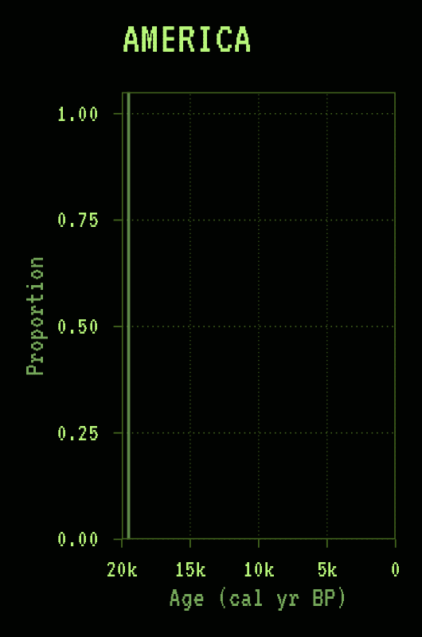{.gif-animated width="100%"}
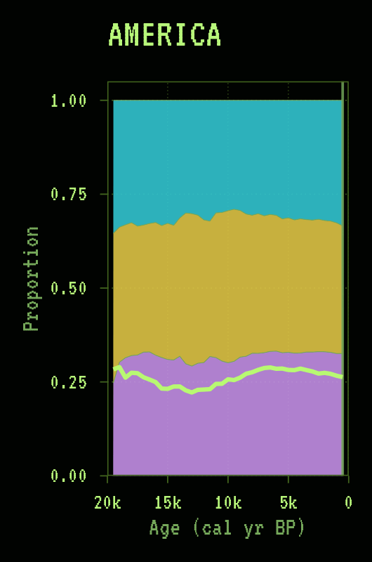{.gif-poster width="100%"}

:::

::: {.column width="28%" .fragment .tui-reveal-blur  data-fragment-index="3"}

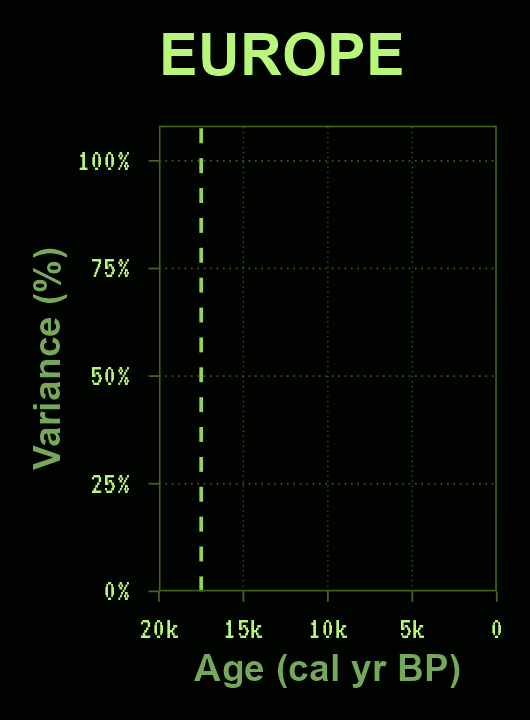{.gif-animated width="100%"}
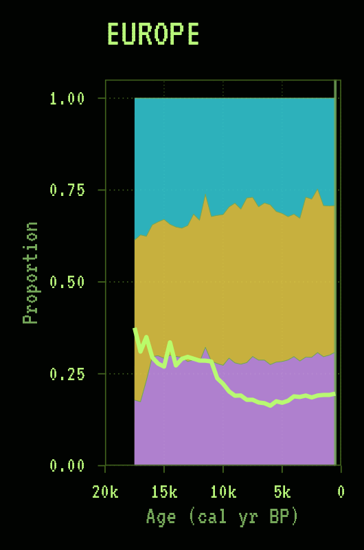{.gif-poster width="100%"}

:::

::: {.column width="28%" .fragment .tui-reveal-blur  data-fragment-index="4"}

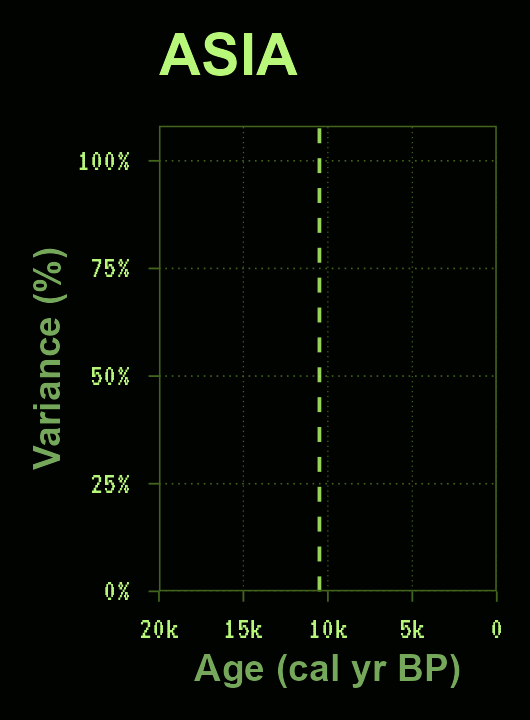{.gif-animated width="100%"}
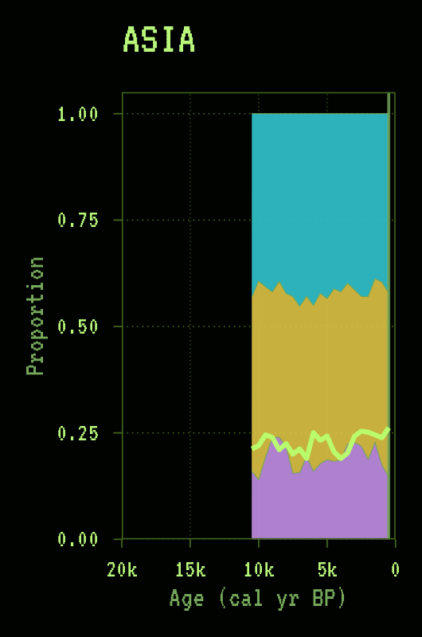{.gif-poster width="100%"}

:::

::: {.column width="16%" .fragment data-fragment-index="2"}

<br>
<br>

```{r}
#| label: result-slide11-legend-render
#| echo: false
#| out-width: 100%
knitr::include_graphics(
  here::here(
    "Documentation/Presentations/IAVS_2026/figures/results/slide_11_temporal_trajectory_legend.png"
  )
)
```

:::

::::

::: {.notes}
ORACLE, plot us the results!
Now we have the analyses for each continent - North America, Europe, and Asia. Each time the line moves, we fit a separate model and decompose the variance, expressed as the colors. In addition, we have the green line, which is the modularity of the community structure.
We see that the modularity changes through time, for example, this drop around 10,000 years ago in Europe, which may be connected to rapid climate change.
Interestingly, the variance decomposition is surprisingly stable through time across all continents.
:::

<!-- slide:12 -->
## [Paleo predictions]{.fragment .fragment-terminal data-fragment-index="0"} {.slide-terminal .slide-terminal-synthesis}

```{r}
#| label: result-slide12-generate
#| include: false
#| cache: true
#| eval: false
source(
  here::here(
    "Documentation/Presentations/IAVS_2026/R/Visualisation/future_predictions_animation.R"
  )
)
```

```{r}
#| label: result-slide12-posters
#| include: false
make_gif_poster("slide_12_future_predictions_selected_taxon.gif")
make_gif_poster("slide_12_future_predictions_expected_genus_richness.gif")
```

:::: {.columns}

::: {.column width="50%" .fragment .tui-reveal-scan data-fragment-index="2"}

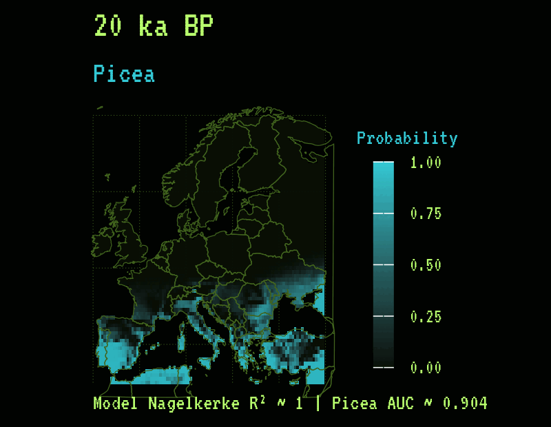{.gif-animated width="100%"}
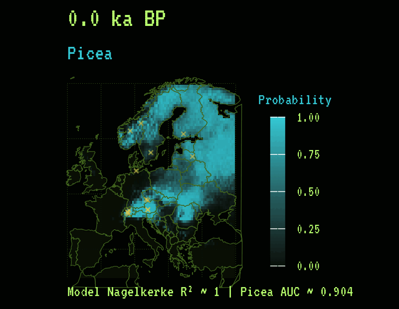{.gif-poster width="100%"}

:::

::: {.column width="50%" .fragment .tui-reveal-scan data-fragment-index="3"}

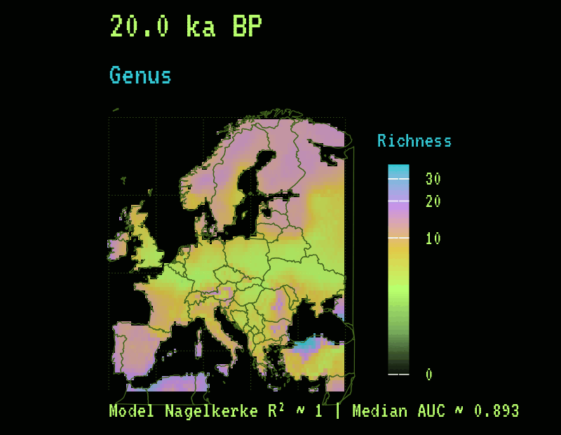{.gif-animated width="100%"}
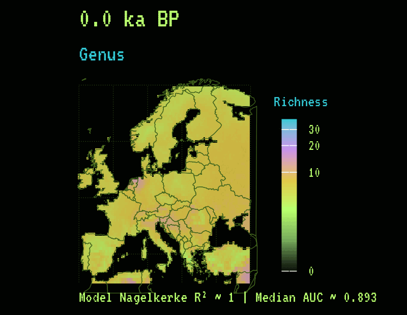{.gif-poster width="100%"}

:::

::::


::: {.oracle-terminal .fragment data-fragment-index="1"}

::: {.oracle-line}
Current [SDM]{.text-emphasis-chip} models can reconstruct [past-to-present]{.text-highlight-temporal} biodiversity patterns and prepare the same machinery for future projection experiments
:::
:::

::: {.notes}
OK, what now? We still have this powerful Species Distribution Model, so we can do what many modelers do, and that is prediction. We will start by predicting into the past. We have the climate data, the spatio-temporal structure, and the species-species association signal; now we will predict the distribution of a specific taxon - in our case, Picea.
The blue color is the predicted probability of the taxon, and each tick is a different time slice. Yellow crosses show the actual detected presence of the taxon. We can see the northward migration of the taxon after the Last Glacial Maximum.
We have this for all taxa, so we can also look at changes in richness.
For me, the logical next step is to use this machinery to predict the future: use the past to better predict future changes in biodiversity.

:::

<!-- slide:13 -->
## [Take-home messages]{.fragment .fragment-terminal data-fragment-index="0"} {.slide-terminal .slide-terminal-synthesis}

```{r}
#| label: result-slide13-generate
#| include: false
#| cache: true
#| eval: false
source(
  here::here(
    "Documentation/Presentations/IAVS_2026/R/Visualisation/synthesis_summary_panel_figure.R"
  )
)
```

::: {.oracle-terminal .fragment data-fragment-index="1"}

::: {.oracle-line}
Consulting deeper reasoning matrices
:::

::: {.oracle-line}
Summarising RESULTS together: [spatial]{.text-highlight-spatial} patterns, [taxonomic]{.text-highlight-latent} resolution, [temporal]{.text-highlight-temporal} dynamics
:::

:::

<br>

```{r}
#| label: slide-13-data-overview 
#| echo: false
#| eval: true
#| include: false
#| cache: false

path_traits_store <-
  here::here(
    "Data",
    "targets",
    "traits_reference",
    "pipeline_traits_reference"
  )

data_spatial_store_index <-
  build_spatial_model_store_index(
    data_source = "paleo",
    scales = c("continental", "regional", "local"),
    pipeline_name = "pipeline_paleo_spatial_resolution",
    path_spatial_grid = here::here("Data", "Input", "spatial_grid.csv")
  ) |>
  dplyr::filter(.data$store_exists)

data_continental_scale_ids <-
  readr::read_csv(
    file = here::here("Data", "Input", "spatial_grid.csv"),
    show_col_types = FALSE
  ) |>
  dplyr::filter(.data$scale == "continental") |>
  dplyr::pull(.data$scale_id)

data_temporal_store_index <-
  tibble::tibble(
    scale_id = data_continental_scale_ids,
    store_path = here::here(
      "Data",
      "targets",
      stringr::str_glue("paleo_temporal_{scale_id}"),
      "pipeline_paleo_temporal"
    )
  ) |>
  dplyr::mutate(
    store_exists = fs::dir_exists(.data$store_path)
  ) |>
  dplyr::filter(.data$store_exists)

vec_continental_store_paths <-
  base::unique(
    c(
      data_spatial_store_index |>
        dplyr::filter(.data$scale == "continental") |>
        dplyr::pull(.data$store_path),
      data_temporal_store_index |>
        dplyr::pull(.data$store_path)
    )
  )

data_continental_community <-
  vec_continental_store_paths |>
  purrr::map(
    .f = ~ read_target_or_null(
      target_name = "data_community_analysis",
      store_path = .x
    )
  ) |>
  purrr::compact() |>
  purrr::list_rbind()

if (
  base::is.null(data_continental_community) ||
    base::nrow(data_continental_community) == 0L
) {
  cli::cli_abort(
    "No continental community data were readable from current stores."
  )
}

data_traits_classified_corrected <-
  read_target_or_null(
    target_name = "data_traits_classified_corrected",
    store_path = path_traits_store
  )

if (
  base::is.null(data_traits_classified_corrected)
) {
  cli::cli_abort(
    "Trait target 'data_traits_classified_corrected' was not readable."
  )
}

number_of_spatial_models <-
  data_spatial_store_index |>
  dplyr::pull(.data$store_path) |>
  purrr::map_int(
    .f = ~ count_successful_targets(
      store_path = .x,
      target_pattern = "^model_evaluation_(genus|family|functional_type)$"
    )
  ) |>
  base::sum()

number_of_temporal_models <-
  data_temporal_store_index |>
  dplyr::pull(.data$store_path) |>
  purrr::map_int(
    .f = ~ count_successful_targets(
      store_path = .x,
      target_pattern = "^model_evaluation_timeslice_"
    )
  ) |>
  base::sum()

number_of_functional_types_raw <-
  data_spatial_store_index |>
  dplyr::filter(.data$scale == "continental") |>
  dplyr::pull(.data$store_path) |>
  purrr::map_int(
    .f = ~ {
      data_functional_type_matrix <-
        read_target_or_null(
          target_name = "data_community_model_matrix_functional_type",
          store_path = .x
        )

      if (
        base::is.null(data_functional_type_matrix)
      ) {
        return(0L)
      }

      base::ncol(data_functional_type_matrix)
    }
  ) |>
  base::sum()

number_of_cores <-
  format_count(
    dplyr::n_distinct(data_continental_community[["dataset_name"]])
  )

number_of_samples <-
  data_continental_community |>
  dplyr::distinct(.data$dataset_name, .data$age) |>
  base::nrow() |>
  format_count()

number_of_taxa <-
  format_count(
    dplyr::n_distinct(data_continental_community[["taxon"]])
  )

number_trait_values <-
  format_count(base::nrow(data_traits_classified_corrected))

number_of_models <-
  format_count(
    number_of_spatial_models + number_of_temporal_models
  )

number_of_functional_types <-
  format_count(number_of_functional_types_raw)
```


::: {.fragment data-fragment-index="2" .text-emphasis-box}
I have used [`r number_of_cores` cores]{.text-bold .text-color-spatial} with [`r number_of_samples` spatio-temporal communities]{.text-bold .text-emphasis-box}, [`r number_of_taxa` taxa]{.text-bold .text-color-latent}, and [`r number_trait_values` trait values]{.text-bold .text-color-latent} translated into [`r number_of_functional_types` functional types]{.text-bold .text-color-latent} to fit [`r number_of_models` models]{.text-bold .text-emphasis-underline-double .text-color-red}.
:::

::: {.fragment data-fragment-index="3" .text-emphasis-box}
Palaeoecological data [CAN]{.text-emphasis-underline .text-emphasis-chip} be used to [reconstruct]{.text-emphasis-underline} [past]{.text-emphasis-underline-dotted} [biodiversity]{.text-color-purple} patterns and provide insights into ecological processes.
:::

::: {.fragment data-fragment-index="4" .text-emphasis-box}
[SPACE]{.text-highlight-spatial}: 
The [association signal]{.text-emphasis-underline-dotted .text-color-latent} is [NOT]{.text-emphasis-underline .text-highlight-warning} scale-dependent and [NOT]{.text-emphasis-underline .text-highlight-warning} stronger at [local]{.text-emphasis-underline-dotted} than at [continental]{.text-emphasis-underline-dotted} scales
:::

::: {.fragment data-fragment-index="5" .text-emphasis-box}  
[TAXONOMY]{.text-highlight-latent}: 
Increasing [taxonomic resolution]{.text-color-latent} [DOES]{.text-emphasis-underline .text-emphasis-chip} have an impact on the [spatial pattern]{.text-color-spatial} of the [association signal]{.text-emphasis-underline-dotted .text-color-latent}, but [NOT]{.text-emphasis-underline .text-highlight-warning} in the [expected direction]{.text-emphasis-underline-dotted}
:::

::: {.fragment data-fragment-index="6" .text-emphasis-box}
[TIME]{.text-highlight-temporal}: 
Co-occurrence structure [IS]{.text-emphasis-underline .text-emphasis-chip} responding to major [environmental changes]{.text-highlight-abiotic}, but the [association signal]{.text-emphasis-underline-dotted .text-color-latent} [IS]{.text-emphasis-underline .text-emphasis-chip} surprisingly [stable]{.text-emphasis-underline} through [time]{.text-highlight-temporal}.
:::

::: {.fragment data-fragment-index="7" .text-emphasis-box}
In addition to contemporary single-species diversity models, [palaeoecological data]{.text-highlight-temporal} can be used to [predict]{.text-emphasis-underline .text-color-red} [future]{.text-emphasis-underline-dotted} [biodiversity]{.text-color-purple} patterns and support [conservation efforts]{.text-emphasis-underline-double}.
:::

::: {.notes}
~just read the text as it comes up~
:::

<!-- slide:14 -->
## [... termination]{.fragment .fragment-terminal data-fragment-index="0"} {.slide-terminal .slide-terminal-story .slide-bg-figure .slide-bg-closing-signal}

<br>
<br>
<br>
<br>
<br>
<br>
<br>
<br>
<br>

::: {.oracle-terminal .fragment data-fragment-index="1"}

::: {.oracle-line}
[Execution complete.]{.text-emphasis-underline}
:::

[]{.oracle-line}

::: {.oracle-line}
Turning off non-essential systems
:::

[]{.oracle-line}

::: {.oracle-line}
[Thank you for your attention]{.text-emphasis-underline-double}
:::

[]{.oracle-line}

::: {.oracle-line}
...
:::

:::

::: {.notes}
This is all the time we have from the supercomputer. ORACLE is turning off.
:::

<!-- slide:15 -->
## Presenter {.slide-title .screen-corners .screen-header .screen-prompt}


:::: {.columns}

::: {.column width="5%"}
:::

::: {.column width="35%"}

::: {.image-height-350 .image-position-center}
{.image-theme-bg-dark top=0 left=100}
:::

::: {.text-position-center .text-size-heading}
[Hi!]{.text-color-amber} I am [Ondřej Mottl]{.text-color-purple .text-bold}
:::

* 🌐 [ondrejmottl.github.io](https://ondrejmottl.github.io/)
* 📧 [ondrej.mottl(at)natur.cuni.cz](mailto:ondrej.mottl(at)natur.cuni.cz)
* 🦋 [ondrejmottl.bsky.social](https://bsky.app/profile/ondrejmottl.bsky.social)

:::

::: {.column width="1%"}
:::

::: {.column width="59%" .text-position-center .text-size-body-large}

<br>

Assistant Professor at 🏛️[Charles University](https://cuni.cz/UK-1.html), Prague, 🇨🇿

<br>

Head of the 🧑‍💻[Laboratory of Quantitative Ecology](https://ondrejmottl.github.io/lab/about_the_lab.html)

<br>

Interested in [macroecology]{.text-emphasis-caps .text-emphasis-chip .text-color-cyan}, [palaeoecology]{.text-emphasis-caps .text-emphasis-chip .text-color-amber}, [biodiversity]{.text-emphasis-caps .text-emphasis-chip .text-color-purple}, and [data science]{.text-emphasis-caps .text-emphasis-chip .text-color-red}

<br>
<br>

:::: {.columns}

::: {.column width="10%"}
:::

::: {.column width="40%"}

{.image-display-block .image-theme-bg-dark top=0 left=50 width="250" height="250"}

:::

::: {.column width="40%"}
```{r}
#| label: QR code https://bit.ly/ondrej_mottl 
#| echo: false
#| eval: true
#| output: false
#| cache: true
generate_qr_code(
  url = "https://bit.ly/ondrej_mottl",
  name = "personal_web",
  background_color = vec_oracle_palette[["background"]],
  foreground_color = vec_oracle_palette[["phosphor"]],
  plot = FALSE
)
```

{.image-display-block top=0 right=0 width="250" height="250"}

:::

::: {.column width="10%"}
:::

::::

:::

::::


::: {.notes}
My name is Ondřej Mottl. I am an assistant professor at Charles University in Prague, Czech Republic. I am the head of the Laboratory of Quantitative Ecology. If you want to find more information about my work and my lab, you can Google my name or scan the QR code.
I am also a huge nerd so I would be very happy to talk about any of the topics, so come and find me after the presentation if you want to chat.
:::

<!-- slide:16 -->
## Presentation availability {.slide-title .screen-corners .screen-header .screen-prompt}

[This presentation is publicly available on the BIODYNAMICS project website]{.text-weight-heading .text-line-height-title .margin-bottom-large .text-shadow-dim .text-uppercase .text-size-heading .text-color-purple .text-emphasis-box .text-position-center}

:::: {.columns}

::: {.column width="25%"}
:::

::: {.column width="25%"}
{.image-theme-bg-dark height="280" width="280" .image-position-center}
:::

::: {.column width="25%"}

```{r}
#| label: QR code https://bit.ly/BIODYNAMICS_project 
#| echo: false
#| eval: true
#| output: false
#| cache: true
generate_qr_code(
  url = "https://bit.ly/BIODYNAMICS_project",
  name = "biodynamics_web",
  background_color = vec_oracle_palette[["background"]],
  foreground_color = vec_oracle_palette[["phosphor"]],
  plot = FALSE
)
```

{.image-display-block width="300" height="300" .image-position-center}
:::

::: {.column width="25%"}
:::

::::

:::: {.columns}
::: {.column width="30%"}
:::

::: {.column width="60%" .image-position-center}

::: {.text-letter-spacing-status .text-bold .r-fit-text}
[bit.ly/BIODYNAMICS_project](https://bit.ly/BIODYNAMICS_project)
:::

:::

::: {.column width="30%"}
:::

::::

<br>

[PDF backup contains static figures only; use the HTML deck for animations]{.display-block .text-position-center .text-color-amber .text-weight-heading .text-size-title-small .margin-bottom-large}  

::: {.text-color-muted .text-letter-spacing-status .text-uppercase .text-position-center}
MIT LICENSE | Supported by [Czech Science Foundation](https://gacr.cz/en/) grant GN23-06386I
:::

::: {.notes}
This presentation is part of the BIODYNAMICS project. Everything, including this presentation, is publicly available on the project website and fully reproducible. You can scan the QR code or go to bit.ly/BIODYNAMICS_project.
:::

<!-- slide:17 -->
## BIODYNAMICS PROJECT {.slide-title .slide-planet-bg .screen-corners .screen-header .screen-prompt .screen-link-oracle}

::: {.planet-scanlines}
:::

:::: {.columns}
::: {.column .panel-line-left .padding-left-large .padding-top-small .padding-bottom-small width="100%"}

[talking to \<ORACLE\>:]{.display-block .text-weight-heading .text-line-height-title .margin-bottom-large .text-shadow-dim .text-uppercase .text-size-heading .text-color-cyan}

[Exploring biotic signals in vegetation assembly from the LGM to the Anthropocene]{.display-block .text-weight-heading .text-line-height-title .margin-bottom-large .text-uppercase .text-size-heading-large .text-color-green .text-shadow .text-line-under .padding-bottom-large}

<br>
<br>

[Ondrej Mottl]{.text-size-title .text-color-purple}

[IAVS 2026 || 22-26 June 2026 || Gijón, Spain]{.text-size-title-small .text-color-amber}

<br>
<br>
<br>

:::

::::

:::: {.columns .panel-line-top .margin-top-large .padding-top-small}

::: {.column width="33%"}
::: {.text-color-muted .text-letter-spacing-status .text-uppercase .text-position-center}
NARRATIVE INTERFACE: **ORACLE**
:::
:::

::: {.column width="33%" .text-position-center .text-color-muted}
.../.../...
:::

::: {.column width="33%"}
::: {.text-color-muted .text-letter-spacing-status .text-uppercase .text-position-center}
ANALYTICAL  OUTPUTS: **REAL**
:::
:::

::::

::: {.notes}
Thank you very much for your attention, and I am looking forward to your questions.
:::

<!-- slide:S00 -->

## {.slide-terminal .slide-terminal-story .slide-section-break}

<pre class="section-break-ascii text-color-temporal" aria-label="Extra slides">                                 
██████ ▄▄ ▄▄ ▄▄▄▄▄▄ ▄▄▄▄   ▄▄▄   
██▄▄   ▀█▄█▀   ██   ██▄█▄ ██▀██  
██▄▄▄▄ ██ ██   ██   ██ ██ ██▀██  
                                 
 ▄▄▄▄ ▄▄    ▄▄ ▄▄▄▄  ▄▄▄▄▄  ▄▄▄▄ 
███▄▄ ██    ██ ██▀██ ██▄▄  ███▄▄ 
▄▄██▀ ██▄▄▄ ██ ████▀ ██▄▄▄ ▄▄██▀ 
</pre>

## Results of contemporary data {.slide-terminal .slide-terminal-results}

<br>
<br>

```{r}
#| label: extra-slide01-generate
#| include: false
#| cache: true
source(
  here::here(
    "Documentation/Presentations/IAVS_2026/R/Visualisation/Extra/modern_spatial_taxonomic_matrix_figure.R"
  )
)
```

```{r}
#| label: extra-slide01-modern-matrix-render
#| echo: false
#| out-width: 80%
knitr::include_graphics(
  here::here(
    "Documentation/Presentations/IAVS_2026/figures/results/extra/slide_extra_01_modern_spatial_taxonomic_matrix.png"
  )
)
```

## Is it a issue of model quality? {.slide-terminal .slide-terminal-results}

<br>

```{r}
#| label: extra-slide02-model-quality-generate
#| include: false
#| cache: true
source(
  here::here(
    "Documentation/Presentations/IAVS_2026/R/Visualisation/Extra/spatial_association_model_quality_figure.R"
  )
)
```

```{r}
#| label: extra-slide02-spatial-model-quality-render
#| echo: false
#| out-width: 100%
knitr::include_graphics(
  here::here(
    "Documentation/Presentations/IAVS_2026/figures/results/extra/slide_extra_02_spatial_association_model_quality.png"
  )
)
```

## Is there relationship between species-species association and network modularity? {.slide-terminal .slide-terminal-results}

<br>

```{r}
#| label: extra-slide02-generate
#| include: false
#| cache: true
source(
  here::here(
    "Documentation/Presentations/IAVS_2026/R/Visualisation/Extra/temporal_association_modularity_figure.R"
  )
)
```

```{r}
#| label: extra-slide02-temporal-association-modularity-render
#| echo: false
#| out-width: 100%
knitr::include_graphics(
  here::here(
    "Documentation/Presentations/IAVS_2026/figures/results/extra/slide_extra_02_temporal_association_modularity.png"
  )
)
```

## Is there relationship between network modularity and network size? {.slide-terminal .slide-terminal-results}

<br>

```{r}
#| label: extra-slide03-generate
#| include: false
#| cache: true
source(
  here::here(
    "Documentation/Presentations/IAVS_2026/R/Visualisation/Extra/temporal_network_size_modularity_figure.R"
  )
)
```

```{r}
#| label: extra-slide03-temporal-network-size-modularity-render
#| echo: false
#| out-width: 100%
knitr::include_graphics(
  here::here(
    "Documentation/Presentations/IAVS_2026/figures/results/extra/slide_extra_03_temporal_network_size_modularity.png"
  )
)
```

## How good predictor is the climate? {.slide-terminal .slide-terminal-results}

<br>

```{r}
#| label: extra-slide04-climate-parameters-generate
#| include: false
#| cache: true
source(
  here::here(
    "Documentation/Presentations/IAVS_2026/R/Visualisation/Extra/spatial_climate_parameters_auc_figure.R"
  )
)
```

```{r}
#| label: extra-slide04-climate-parameters-render
#| echo: false
#| out-width: 100%
knitr::include_graphics(
  here::here(
    "Documentation/Presentations/IAVS_2026/figures/results/extra/slide_extra_04_spatial_climate_parameters_auc.png"
  )
)
```

## How good predictor is the climate? {.slide-terminal .slide-terminal-results}

<!-- Spatial model - EU - continental- genus- - SE of parameters for all taxa, AUC for all taxa -->

## How are the Functional Types generated {.slide-terminal .slide-terminal-results}

<!-- PCA of Europe dissimilarity of taxon, colored by the FT, some major taxa highlited and the names for FT groups are suggested (1-3 groups) -->

## Pipeline architecture - spatial {.slide-terminal .slide-terminal-methods}

<!-- embeded visualisation of Europe spatial pipeline -->

## Pipeline architecture - temporal {.slide-terminal .slide-terminal-methods}

<!-- embeded visualisation of Europe temporal pipeline -->

