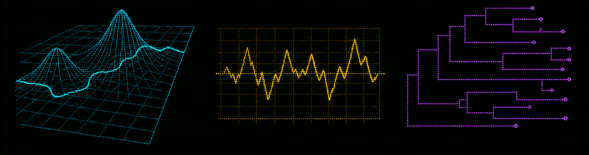

## BIODYNAMICS: ECOLOGICAL BIOSURVEILLANCE SYSTEM {.slide-title .screen-corners .screen-header .screen-prompt .screen-link-oracle}

<!-- slide:00 -->

:::: {.columns}
::: {.column .panel-line-left .padding-left-large .padding-top-small .padding-bottom-small width="80%"}

[talking to &lt;ORACLE&gt;:]{.display-block .text-weight-heading .text-line-height-title .margin-bottom-large .text-shadow-dim .text-uppercase .text-size-heading .text-color-cyan}

[Exploring biotic signals in vegetation assembly from the LGM to the Anthropocene]{.display-block .text-weight-heading .text-line-height-title .margin-bottom-large .text-uppercase .text-size-heading-large .text-color-green .text-shadow .text-line-under .padding-bottom-large}

<br>

[Ondrej Mottl]{.text-size-title .text-color-purple .text-bold }

[IAVS 2026 || 22-26 June 2026 || Gijón, Spain]{.text-size-title-small .text-color-amber}

:::

::: {.column width="20%"}
{.image-display-block .margin-x-auto .image-blend-screen .image-fit-contain .width-full .image-glow}
:::

::::

:::: {.columns .panel-line-top .margin-top-large .padding-top-small}

::: {.column width="33%"}
::: {.text-color-muted .text-letter-spacing-status .text-uppercase .text-position-center}
NARRATIVE INTERFACE: **ORACLE**
:::
:::

::: {.column width="33%" .text-position-center .text-color-muted}
.../.../...
:::

::: {.column width="33%"}
::: {.text-color-muted .text-letter-spacing-status .text-uppercase .text-position-center}
ANALYTICAL  OUTPUTS: **REAL**
:::
:::

::::

::: {.notes}
TIME 00:25. I will ask the audience to close their eyes and imagine there are on a space ship and their goal is to examine the vegtation patterns of this Planet called "Earth". We will use of the spaceship computer called ORACLE to do so. All the data, analysis, and results are real. The computer is not real and only serves as a narrative device.
:::

<!-- slide:01 -->
## [... booting]{.fragment .fragment-terminal data-fragment-index="0"} {.slide-terminal .slide-terminal-story}

:::: {.columns}
::: {.column width="50%" .fragment .tui-reveal-scan}
{.image-display-block .margin-x-auto .image-height-750 .image-blend-screen .image-fit-contain .width-full}
:::

::: {.column width="50%" .fragment}
::: {.oracle-terminal}

::: {.oracle-line}
[System online]{.text-emphasis-chip}
:::

[]{.oracle-line}

::: {.oracle-line}
Greetings Dr. Mottl
:::

[]{.oracle-line}

::: {.oracle-line}
I am [O]{.text-emphasis-underline}bservational [R]{.text-emphasis-underline}untime for [A]{.text-emphasis-underline}nalysis of [C]{.text-emphasis-underline}ommunity-[L]{.text-emphasis-underline}evel [E]{.text-emphasis-underline}cology
:::

::: {.oracle-line}
[&lt;ORACLE&gt;]{.text-emphasis-chip .text-emphasis-underline-double} for short
:::

[]{.oracle-line}

::: {.oracle-line}
I am here to assist you in analyzing vegetation patterns on Earth
:::

[]{.oracle-line}

::: {.oracle-line}
[Awaiting ecological query.]{.text-emphasis-chip}
:::

[]{.oracle-line}

[]{.oracle-line}

::: {.oracle-line}
Proceed? [Y]/[N]?
:::
:::

:::
::::

:::: {.columns .margin-top-large .padding-top-small}

::: {.column width="33%"}
::: {.text-color-muted .text-letter-spacing-status .text-uppercase .text-position-center}
BIOSPHERE DIVERSITY: **HIGH** 
:::
:::

::: {.column width="33%" .text-position-center .text-color-muted}
CHANGE: **ACCELERATING** 
:::

::: {.column width="33%"}
::: {.text-color-muted .text-letter-spacing-status .text-uppercase .text-position-center}
UNCERTAINTY: **SUBSTANTIAL**
:::
:::

::::

::: {.notes}
TIME 00:35. Welcome fellow scientists, you may open your eyes! I am Ondřej Mottl, the chief researcher at this space station. We have 12 minutes to explore the vegetation patterns of a alian planet called 'Earth' using the ORACLE system. Let's get started. ORACLE, please boot up and introduce yourself.
:::

<!-- slide:02 -->
## [Is there a [scale dependence]{.text-bold .text-emphasis-underline} in the amount of [unexplained variation]{.text-emphasis-underline-dotted} (potentially due to [biotic interactions]{.text-color-latent}) structuring vegetation?]{.fragment .fragment-terminal data-fragment-index="0"} {.slide-terminal .slide-terminal-question}

:::: {.columns}

::: {.column width="35%" .fragment data-fragment-index="1"}

<br>
<br>

::: {.oracle-terminal}

::: {.oracle-line}
Query accepted
:::

[]{.oracle-line}

::: {.oracle-line}
Plan to [partition]{.text-emphasis-underline} observed plant co-occurrence into:
:::

[]{.oracle-line}

::: {.oracle-line}
[spatial]{.text-highlight-spatial} structure
:::

::: {.oracle-line}
[climate]{.text-highlight-abiotic} response
:::

::: {.oracle-line}
[species-species association]{.text-highlight-latent} (residual)
:::
:::

:::

::: {.column width="65%" .fragment .tui-reveal-scan data-fragment-index="2"}
{.image-display-block .margin-x-auto .image-blend-screen .image-fit-contain .width-full .image-height-750}
:::

::::

::: {.notes}
TIME 00:45. Oracle, I would like like to explore vegation patterns across space and time of this planet. From our knowlege banks we know that vegetation is mostly explaineby climate and spatial factors. However, I am particullary interested in the unexplained variation. My first question is simple: Does the unexplained part of the community pattern change with scale, or does it stay broadly consistent?
:::

<!-- slide:03 -->
## [DATA: [&lt;VegVault&gt;]{.text-emphasis-chip}]{.fragment .fragment-terminal data-fragment-index="0"} {.slide-terminal .slide-terminal-methods}

:::: {.columns}
::: {.column width="62%" }

::: {.image-height-400 .fragment .tui-reveal-blur data-fragment-index="2"}
--figure/schematics of data input--
:::

::: {.image-height-400 .fragment .tui-reveal-blur data-fragment-index="3"}
--Northern Hemisphere coverage figure--
:::

:::

::: {.column width="38%" }
::: {.oracle-terminal .fragment data-fragment-index="1"}

::: {.oracle-line}
[&lt;VegVault&gt;]{.text-emphasis-chip} database: publicly available open source database
:::

[]{.oracle-line}

::: {.oracle-line}
[Community records]{.text-emphasis-box}, [climate predictors]{.text-color-abiotic}, [site coordinates]{.text-color-spatial}, and [functional traits]{.text-color-latent} are loaded as separate streams.
:::

[]{.oracle-line}

::: {.oracle-line}
Due to [data availability]{.text-emphasis-underline-dotted}, I will focus on the [Northern Hemisphere]{.text-emphasis-underline-double} of the planet.
:::
:::

::: {.fragment .tui-reveal-scan data-fragment-index="4"}

:::: {.columns .image-height-750}

::: {.column width="50%"}
--VegVault logo--
:::

::: {.column width="50%"}
--QR code--
:::

::::


:::

:::
::::

::: {.notes}
TIME 00:45. Oracle, Load the VegVault database to get vegetation data, climate predictors, and functional traits for our analysis.
The database is publicly available and open source. For this analysis, we will focus on the Northern Hemisphere of the planet, which includes North America, Europe, and Asia.
:::

<!-- slide:04 -->
## [Three analysis axes]{.fragment .fragment-terminal data-fragment-index="0"} {.slide-terminal .slide-terminal-methods}

<br>

::: {.fragment .tui-reveal-scan data-fragment-index="2"}
::: {.image-display-block .margin-x-auto .image-blend-screen .image-fit-contain .width-full}
{.image-display-block .margin-x-auto .image-blend-screen .image-fit-contain .width-full .image-height-400}
:::
:::

<br>

::: {.oracle-terminal .fragment data-fragment-index="1"}

::: {.oracle-line}
Three routes selected:
:::

::: {.oracle-line}
[Spatial-resolution runs]{.text-highlight-spatial} : chnages with spatial scale
:::

::: {.oracle-line}
[Temporal slices test]{.text-highlight-abiotic} : change through time.
:::

::: {.oracle-line}
[Taxonomic aggregation level]{.text-highlight-latent} : change through classification.
:::
:::


::: {.notes}
TIME 00:35. Now, we would like to split the analysis along space (from local to continental), time (since the last glacial maximum), and taxonomic resolution (from genus up to abstract functional types).
:::

<!-- slide:05 -->
## [Preparing [community]{.text-emphasis-box} and [climate]{.text-highlight-abiotic} streams]{.fragment .fragment-terminal data-fragment-index="0"} {.slide-terminal .slide-terminal-methods}

:::: {.columns}

::: {.column width="40%"}

<br>

::: {.oracle-terminal .fragment data-fragment-index="1"}

::: {.oracle-line}
Data extracted, now [preparation]{.text-emphasis-underline-dotted} ...
:::

[]{.oracle-line}

::: {.oracle-line}
[[Community]{.text-emphasis-box} stream normalised]{.text-emphasis-underline}
:::

::: {.oracle-line}
 - proportions filtered
:::

::: {.oracle-line}
 - Taxa are classified [automatically]{.text-emphasis-underline-dotted} to GBIF and filtered
:::

[]{.oracle-line}

::: {.oracle-line}
[[Climate]{.text-highlight-abiotic} stream screened]{.text-emphasis-underline}
:::

::: {.oracle-line}
 - [Redundant]{.text-emphasis-underline-dotted} predictors are [removed]{.text-emphasis-underline-dotted} before model fitting.
:::
:::


:::

::: {.column width="60%" .fragment .tui-reveal-blur data-fragment-index="2" .image-height-750}
--Figure to show some climate data summary---
:::
::::

::: {.notes}
TIME 00:45. Oracle, we now need to apply data processing to community data and climate predictors to make them ready for analysis.
:::

<!-- slide:06 -->
## Model core: [environment]{.text-color-abiotic}, [space]{.text-color-spatial}, [association]{.text-color-latent} {.slide-terminal .slide-terminal-methods}

:::: {.columns}
::: {.column width="65%" .fragment .tui-reveal-blur data-fragment-index="2" .image-height-750}
--Schematic of model components and variance partitioning--
(we can use either mermaid or a custom schematic)

--maybe a mathematical formula for the model--
:::

::: {.column width="35%" .fragment data-fragment-index="1"}

<br>
<br>

::: {.oracle-terminal}

::: {.oracle-line}
[Model assembled.]{.text-emphasis-chip}
:::

[]{.oracle-line}

::: {.oracle-line}
[Abiotic predictors]{.text-highlight-abiotic} explain shared response.
:::

[]{.oracle-line}

::: {.oracle-line}
[Moran Eigenvector Maps]{.text-highlight-spatial} (MEMs) absorb spatio-temporal autocorrelation.
:::

[]{.oracle-line}

::: {.oracle-line}
[Residual covariance]{.text-highlight-latent} carries species-species association signal.
:::

:::
:::
::::

::: {.notes}
TIME 00:45. Oracle, build a model, which would include climate, spatial structure, and whatever residual association remains.
We will be uisng {sjSDM} R package is used because the community matrix and spatial design are too large for slower MCMC workflows.
:::

<!-- slide:07 -->
## [Variance decomposition]{.text-emphasis-box} {.slide-terminal .slide-terminal-methods}

:::: {.columns}

::: {.column width="50%" .fragment data-fragment-index="1"}

<br>
<br>

::: {.oracle-terminal}

::: {.oracle-line}
Decomposition ready.
:::

[]{.oracle-line}

::: {.oracle-line}
Focus: [residual association component]{.text-emphasis-box}
:::

[]{.oracle-line}

::: {.oracle-line}
Report what remains after climate and spatial 
structure have made their claims.
:::

[]{.oracle-line}

::: {.oracle-line}
[Caution]{.text-highlight-warning}: co-occurrence is not proof of [interaction]{.text-highlight-warning}.
:::

:::
:::

::: {.column width="50%" .fragment .tui-reveal-blur data-fragment-index="2" .image-height-750} 
--schematic to show the variance decomposition and the focus on the residual association component--
:::


::::

::: {.notes}
TIME 00:40. Now we would like to decompose the explained variance so we can separate climate, space, and residual association.
The shared fractions are useful diagnostics for understanding the model fit. However, we will focus on the non-shared residual association component.
:::

<!-- slide:08 -->
## [Spatial results]{.text-color-spatial}: local to continental {.slide-terminal .slide-terminal-results}

:::: {.columns}
::: {.column width="50%"}

::: {.image-height-600 .fragment .tui-reveal-blur data-fragment-index="2"}
--Map of Northem America with the three spatial units outlined: local, regional, continental--
:::

:::

::: {.column width="50%"}
::: {.image-height-600 .fragment .tui-reveal-blur data-fragment-index="3"}
--tile plot showing 3 columns (scale), each tile (a unit) is colored by the the amount of association--
:::
:::

::::

::: {.oracle-terminal .fragment data-fragment-index="1"}

::: {.oracle-line}
Spatial scan configured.
:::

::: {.oracle-line}
Units are nested from local to regional to continental.
:::
:::

::: {.notes}
TIME 00:50. Oracle, start with the spatial axis. Show how the association signal changes across local, regional, and continental units.
What do we see? Is there a clear change in the association signal across spatial scales? I would expect that local units have stronger association signal than continental units, but the pattern is not showing!
:::

<!-- slide:09 -->
## How does the [spatial pattern]{.text-color-spatial} change when we add [taxonomic resolution]{.text-color-latent}? {.slide-terminal .slide-terminal-question}

:::: {.columns}
::: {.column width="65%" .fragment .tui-reveal-blur  data-fragment-index="2" .image-height-750}
--Expland on the Figure 2 from previous slide. Now 3 columns (spatial scale) and 3 rows (taxonomic scale), each tile (a unit) is colored by the the amount of association--
:::

::: {.column width="35%"}

<br>
<br>

::: {.oracle-terminal}

::: {.oracle-line}
Query accepted...
:::

[]{.oracle-line}

::: {.oracle-line}
Adding taxonomic axis.
:::

[]{.oracle-line}

::: {.oracle-line}
Plotting the results.
:::

:::

:::
::::

::: {.notes}
TIME 00:45. Oracle, how does the spatial pattern change when we add taxonomic resolution? We assume that higher higher taxonomic resolution will result in smaller association signal in local units and vice versa.
Interestingly, the change in taxonomic resolution does not seem to affect the spatial patterns. This is surprising, as we would expect that higher taxonomic resolution would result in smaller association signal in local units and vice versa.
:::

<!-- slide:10 -->
## Is the association signal stable through [time]{.text-color-abiotic}? {.slide-terminal .slide-terminal-question}

:::: {.columns}

::: {.column width="35%"}
::: {.oracle-terminal .fragment  data-fragment-index="1"}

::: {.oracle-line}
Query accepted.
:::

[]{.oracle-line}

::: {.oracle-line}
Temporal mode selected: Slicing the data into 500-year windows.
:::

[]{.oracle-line}

::: {.oracle-line}
Network diagnostics loaded. Co-occurrence structure can change even when variance components look similar.
:::

[]{.oracle-line}

::: {.oracle-line}
Each slice receives an independent analysis and diagnostics.
:::

[]{.oracle-line}

::: {.oracle-line}
Plotting the results.
:::

[]{.oracle-line}

::: {.oracle-line}
Proceed? Y/N?
:::

:::
:::

::: {.column width="65%"}

:::{.fragment .tui-reveal-blur  data-fragment-index="2" .image-height-400}
-- Distribution of data across the temporal axis, showing where the data are dense or sparse.--
:::

:::: {.columns .image-height-400}

::: {.column width="50%" .fragment .tui-reveal-blur  data-fragment-index="3"}
schematic of bipartite network pipeline, highligting one time slice from figure 1.
:::

::: {.column width="50%" .fragment .tui-reveal-blur  data-fragment-index="4"}
schematic of temporal pipeline, showing how each slice is processed independently.
:::

::::

:::
::::

::: {.notes}
TIME 00:50. Oracle, now let' switch to temporal mode and test whether the association signal stays stable through time.
Now each time slice receives an independent analyses and diagnostics. We will be looking at the temporal trajectories of the association signal, but also at the network structure, which can change even when variance components look similar. Proceed ORACLE!
:::

<!-- slide:11 -->
## [Temporal trajectories]{.text-color-abiotic} {.slide-terminal .slide-terminal-results}

::: {.oracle-terminal}

::: {.oracle-line}
Plotting temporal trajectories.
:::
:::

:::: {.columns}
::: {.column width="33.33%" .fragment .tui-reveal-blur  data-fragment-index="1" .image-height-600}
--NORTH AMERICA--
:::

::: {.column width="33.33%" .fragment .tui-reveal-blur  data-fragment-index="2" .image-height-600}
--EUROPE--
:::

::: {.column width="33.33%" .fragment .tui-reveal-blur  data-fragment-index="3" .image-height-600}
--ASIA--
:::

::::

::: {.notes}
TIME 00:50. The network structure and the variance components are changing through time, There is no clear pattern change during the LGM transition and during the strong anthropogenic changes during late Holocene. However, this is not consistent for all continents. Moreover, the association signal is not respoding in the same way as the network structure.
:::

<!-- slide:12 -->
## Synthesis pending verification {.slide-terminal .slide-terminal-synthesis}

::: {.oracle-terminal .fragment data-fragment-index="1"}

::: {.oracle-line}
Weaving realities together: spatial patterns, taxonomic resolution, temporal dynamics.
:::

::: {.oracle-line}
Consulting deeper reasoning matrices.
:::

::: {.oracle-line}
Summarizing results.
:::
:::

::: {.fragment data-fragment-index="2"}
[SPACE]{.text-color-spatial}<br>
Local to continental comparison.

[TAXONOMY]{.text-color-latent}<br>
Genus / family / functional-type comparison.

[TIME]{.text-color-abiotic}<br>
Palaeo trajectory and network comparison.
:::

::: {.notes}
TIME 00:45. TBD
:::

<!-- slide:13 -->
## [Future predictions]{.text-emphasis-box} {.slide-terminal .slide-terminal-synthesis}

:::: {.columns}
::: {.column .fragment .tui-reveal-scan width="65%" data-fragment-index="1"}
{.image-display-block .margin-x-auto .image-height-story .image-blend-screen .image-fit-contain .width-full}
:::

::: {.column width="35%"}
::: {.oracle-terminal}

::: {.oracle-line}
Current models can be used to [futher predict]{.text-emphasis-caps .text-emphasis-underline-thick} the biodiversity patterns under the climate change scenarios.
:::
:::

:::
::::

::: {.notes}
TIME 00:40. 
:::

<!-- slide:14 -->
## [Query resolved]{.text-emphasis-caps .text-emphasis-underline-double} ... termination {.slide-terminal .slide-terminal-story}

:::: {.columns}
::: {.column width="35%"}
::: {.oracle-terminal .fragment data-fragment-index="1"}

::: {.oracle-line}
[Execution complete.]{.text-emphasis-chip}
:::

::: {.oracle-line}
Turning off non-essential systems.
:::

::: {.oracle-line}
Thank you for your attention.
:::

:::

:::

::: {.column width="35%" .fragment .tui-reveal-scan data-fragment-index="2"}
{.image-display-block .margin-x-auto .image-height-600 .image-blend-screen .image-fit-contain .width-full}
:::
::::

::: {.notes}
TIME 00:20. 
:::

<!-- slide:15 -->
## [Hi!]{.text-color-amber} I am [Ondřej Mottl]{.text-color-purple}{.slide-title .screen-corners .screen-header .screen-prompt}

<br>

:::: {.columns}

::: {.column width="35%" .image-height-400}
--head photo--
:::

::: {.column width="1%"}

:::

::: {.column width="64%" .text-position-center}

Assistant Professor at 🏛️[Charles University](https://cuni.cz/UK-1.html), Prague, 🇨🇿

<br>

Interested in [macroecology]{.text-color-amber .text-emphasis-underline-wave}, [palaeoecology]{.text-color-cyan .text-emphasis-underline-wave}, [biodiversity]{.text-color-purple .text-emphasis-underline-wave}, and [data science]{.text-color-red .text-emphasis-underline-wave}

<br>

Head of the 🧑‍💻[Laboratory of Quantitative Ecology](https://ondrejmottl.github.io/lab/about_the_lab.html)

:::

::::

:::: {.columns}

::: {.column width="5%"}
:::

::: {.column width="45%" .text-size-body}

* 📧 ondrej.mottl(at)natur.cuni.cz
* 🦋 [ondrejmottl.bsky.social](https://bsky.app/profile/ondrejmottl.bsky.social)
* 🐱 [Github](https://github.com/OndrejMottl)
* 🆔 [ORCID](https://orcid.org/0000-0002-9796-5081)
* 🌐 [Personal webpage](https://ondrejmottl.github.io/)
:::

::: {.column width="9%"}
:::


::: {.column width="20%" .image-height-300}

--LOQE logo--

:::

::: {.column width="21%"}
:::

::::

```{r}
#| label: QR code https://bit.ly/ondrej_mottl 
# generate_qr_code(
#   url = "https://bit.ly/ondrej_mottl",
#   name = "personal_web",
#   foreground_color = "black",
#   background_color = "white",
#   plot = FALSE
# )
```

{.absolute top=0 right=0 width="120" height="120"}


::: {.notes}
TIME 00:20. 
:::

<!-- slide:16 -->
## Presentation availability {.slide-title .screen-corners .screen-header .screen-prompt}

<br>

[This presentation is publicly available on BIODYNAMICS project websites]{.display-block .text-weight-heading .text-line-height-title .margin-bottom-large .text-shadow-dim .text-uppercase .text-size-heading .text-color-purple .text-emphasis-box}

:::: {.columns}
::: {.column width="50%"}

<br>
<br>
<br>
<br>

::: {.text-color-muted .text-letter-spacing-status .text-uppercase .text-bold .r-fit-text .text-emphasis-underline}
[bit.ly/biodynamics](https://bit.ly/biodynamics)
:::


:::

::: {.column width="50%" .image-height-600}
QR CODE
:::
::::

::: {.text-color-muted .text-letter-spacing-status .text-uppercase .text-position-center}
MIT LICENSE
:::

::: {.notes}
TIME 00:25. This presentation is publicly available. The rendered presentation and other materials are  accessible via the project website. TheQR code will link to the access page where slides, code, and documentation can be found.
:::

<!-- slide:17 -->
## BIODYNAMICS: ECOLOGICAL BIOSURVEILLANCE SYSTEM {.slide-title .screen-corners .screen-header .screen-prompt .screen-link-oracle}

<!-- slide:00 -->

:::: {.columns}
::: {.column .panel-line-left .padding-left-large .padding-top-small .padding-bottom-small width="80%"}

[talking to &lt;ORACLE&gt;:]{.display-block .text-weight-heading .text-line-height-title .margin-bottom-large .text-shadow-dim .text-uppercase .text-size-heading .text-color-cyan}

[Exploring biotic signals in vegetation assembly from the LGM to the Anthropocene]{.display-block .text-weight-heading .text-line-height-title .margin-bottom-large .text-uppercase .text-size-heading-large .text-color-green .text-shadow .text-line-under .padding-bottom-large}

<br>

[Ondrej Mottl]{.text-size-title .text-color-purple .text-bold }

[IAVS 2026 || 22-26 June 2026 || Gijón, Spain]{.text-size-title-small .text-color-amber}

:::

::: {.column width="20%"}
{.image-display-block .margin-x-auto .image-blend-screen .image-fit-contain .width-full .image-glow}
:::

::::

:::: {.columns .panel-line-top .margin-top-large .padding-top-small}

::: {.column width="33%"}
::: {.text-color-muted .text-letter-spacing-status .text-uppercase .text-position-center}
NARRATIVE INTERFACE: **ORACLE**
:::
:::

::: {.column width="33%" .text-position-center .text-color-muted}
.../.../...
:::

::: {.column width="33%"}
::: {.text-color-muted .text-letter-spacing-status .text-uppercase .text-position-center}
ANALYTICAL  OUTPUTS: **REAL**
:::
:::

::::

::: {.notes}
TIME 00:25. I will ask the audience to close their eyes and imagine there are on a space ship and their goal is to examine the vegtation patterns of this Planet called "Earth". We will use of the spaceship computer called ORACLE to do so. All the data, analysis, and results are real. The computer is not real and only serves as a narrative device.
:::
