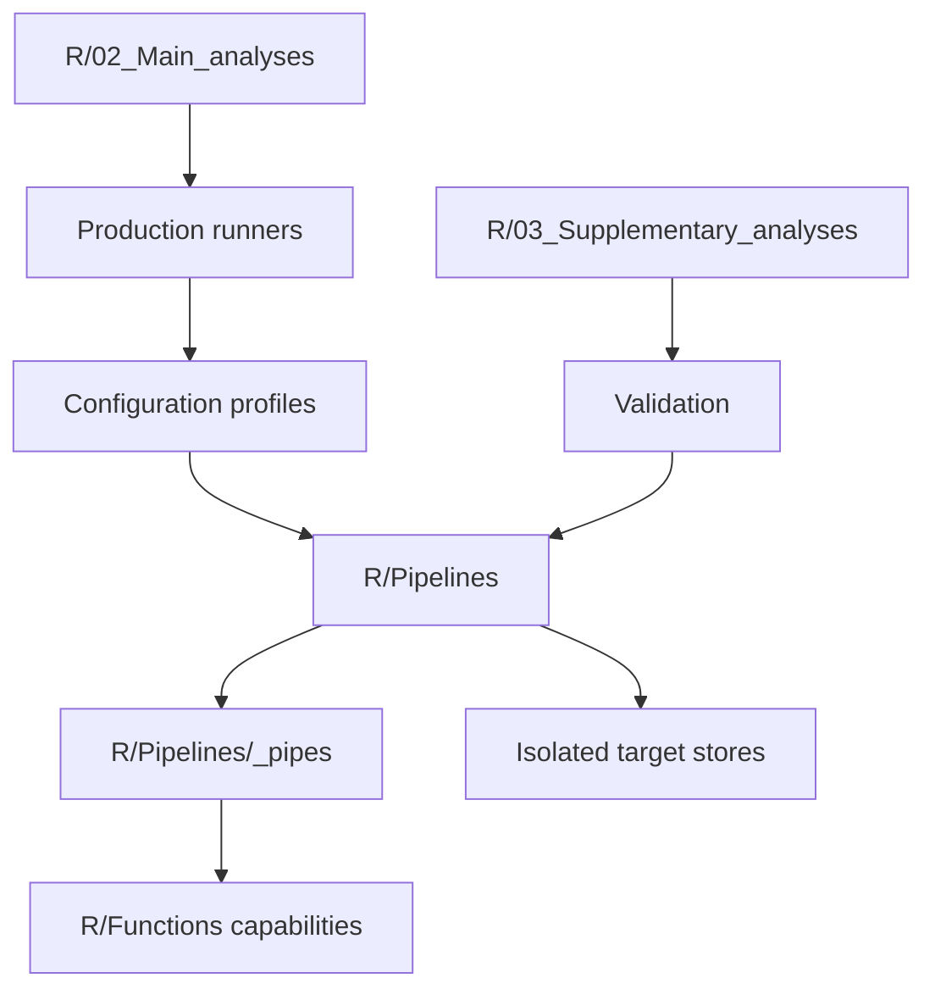
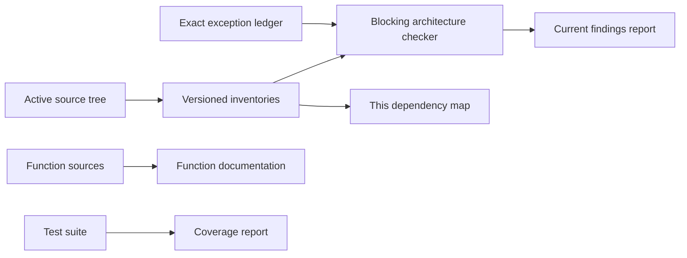

# R architecture and dependency map

This maintained map is generated from the versioned script, function, persisted-contract, manifest, and architecture-exception inventories. Do not edit generated tables manually.

## Repository architecture



- `R/02_Main_analyses/` owns stable production-facing orchestration, scientific synthesis, and final visualisation.
- `R/03_Supplementary_analyses/` owns diagnostics, validation, tests, sensitivity work, and one-time provenance.
- `R/Functions/` owns reusable one-function-per-file capabilities.
- `R/Pipelines/` owns target graphs and reusable pipe segments.

## Script lifecycle

| Classification | Active inventory rows |
|---|---:|
| diagnostic | 16 |
| issue_reproduction | 6 |
| main_analysis | 19 |
| one_time | 4 |
| pipeline_definition | 46 |
| project_setup | 3 |
| reference | 13 |
| scientific_reference | 2 |
| sensitivity | 1 |
| supplementary_or_processing | 19 |
| test | 379 |

## Function capabilities

| Capability | Active functions |
|---|---:|
| Data/Abiotic | 5 |
| Data/Community | 39 |
| Data/Samples | 7 |
| Data/Spatial | 6 |
| Data/Time | 12 |
| Data/Traits | 30 |
| Data_access/Files | 1 |
| Data_access/Vegvault | 5 |
| Modelling/Cross_validation | 111 |
| Modelling/Decomposition | 19 |
| Modelling/Evaluation | 16 |
| Modelling/Fit_inputs | 11 |
| Modelling/Fitting | 10 |
| Modelling/Spatial_effects | 12 |
| Modelling/Variance_partitioning | 6 |
| Pipeline/Configuration | 11 |
| Pipeline/Definitions | 5 |
| Pipeline/Orchestration | 8 |
| Pipeline/Stores | 7 |
| Prediction/Climate | 1 |
| Prediction/Grids | 1 |
| Prediction/Inference | 2 |
| Prediction/Inputs | 1 |
| Prediction/Scaling | 1 |
| Prediction/Summaries | 1 |
| Visualisation/Maps | 1 |
| Visualisation/Networks | 1 |
| Visualisation/Spatial_variance | 8 |
| Visualisation/Variance_components | 3 |

## Pipe-segment capability dependencies

| Pipe segment | Function capability | Active functions |
|---|---|---:|
| `R/Pipelines/_pipes/_helpers/make_community_filter_targets.R` | Data/Community | 4 |
| `R/Pipelines/_pipes/_helpers/make_pipe_segment_ft_classification_continental.R` | Data/Community | 7 |
| `R/Pipelines/_pipes/_helpers/make_pipe_segment_ft_classification_continental.R` | Data/Traits | 7 |
| `R/Pipelines/_pipes/_helpers/make_pipe_segment_ft_classification_continental.R` | Pipeline/Configuration | 3 |
| `R/Pipelines/_pipes/_helpers/make_pipe_segment_ft_classification_continental.R` | Pipeline/Stores | 3 |
| `R/Pipelines/_pipes/pipe_segment_abiotic_extract.R` | Data/Abiotic | 4 |
| `R/Pipelines/_pipes/pipe_segment_abiotic_extract.R` | Data/Time | 2 |
| `R/Pipelines/_pipes/pipe_segment_community_by_resolution_modern.R` | Data/Community | 2 |
| `R/Pipelines/_pipes/pipe_segment_community_by_resolution_paleo.R` | Data/Community | 2 |
| `R/Pipelines/_pipes/pipe_segment_community_extract.R` | Data/Community | 2 |
| `R/Pipelines/_pipes/pipe_segment_community_extract.R` | Data/Time | 2 |
| `R/Pipelines/_pipes/pipe_segment_community_prepare_modern.R` | Data/Community | 5 |
| `R/Pipelines/_pipes/pipe_segment_community_prepare_paleo.R` | Data/Community | 3 |
| `R/Pipelines/_pipes/pipe_segment_community_prepare_paleo.R` | Data/Time | 3 |
| `R/Pipelines/_pipes/pipe_segment_community_prepare_paleo.R` | Data_access/Vegvault | 2 |
| `R/Pipelines/_pipes/pipe_segment_config_common.R` | Data/Spatial | 1 |
| `R/Pipelines/_pipes/pipe_segment_config_common.R` | Pipeline/Configuration | 1 |
| `R/Pipelines/_pipes/pipe_segment_config_common.R` | Pipeline/Stores | 1 |
| `R/Pipelines/_pipes/pipe_segment_config_model.R` | Pipeline/Configuration | 2 |
| `R/Pipelines/_pipes/pipe_segment_config_model_by_resolution.R` | Pipeline/Configuration | 3 |
| `R/Pipelines/_pipes/pipe_segment_ft_classification_continental.R` | Data/Traits | 1 |
| `R/Pipelines/_pipes/pipe_segment_model_anova.R` | Modelling/Variance_partitioning | 1 |
| `R/Pipelines/_pipes/pipe_segment_model_assemble.R` | Modelling/Fit_inputs | 1 |
| `R/Pipelines/_pipes/pipe_segment_model_cross_validation.R` | Modelling/Cross_validation | 10 |
| `R/Pipelines/_pipes/pipe_segment_model_cross_validation_execution.R` | Modelling/Cross_validation | 27 |
| `R/Pipelines/_pipes/pipe_segment_model_cross_validation_execution.R` | Pipeline/Configuration | 1 |
| `R/Pipelines/_pipes/pipe_segment_model_cross_validation_execution.R` | Pipeline/Stores | 1 |
| `R/Pipelines/_pipes/pipe_segment_model_cross_validation_from_shared.R` | Modelling/Cross_validation | 8 |
| `R/Pipelines/_pipes/pipe_segment_model_cross_validation_shared.R` | Data/Samples | 1 |
| `R/Pipelines/_pipes/pipe_segment_model_cross_validation_shared.R` | Modelling/Cross_validation | 6 |
| `R/Pipelines/_pipes/pipe_segment_model_cross_validation_shared.R` | Pipeline/Configuration | 1 |
| `R/Pipelines/_pipes/pipe_segment_model_fit.R` | Modelling/Evaluation | 2 |
| `R/Pipelines/_pipes/pipe_segment_model_fit.R` | Modelling/Fit_inputs | 1 |
| `R/Pipelines/_pipes/pipe_segment_model_fit.R` | Modelling/Fitting | 1 |
| `R/Pipelines/_pipes/pipe_segment_model_input.R` | Modelling/Fit_inputs | 2 |
| `R/Pipelines/_pipes/pipe_segment_model_prepare_response.R` | Data/Community | 3 |
| `R/Pipelines/_pipes/pipe_segment_model_prepare_response.R` | Modelling/Fit_inputs | 1 |
| `R/Pipelines/_pipes/pipe_segment_model_spatial_samples.R` | Modelling/Fit_inputs | 2 |
| `R/Pipelines/_pipes/pipe_segment_model_spatial_samples.R` | Modelling/Spatial_effects | 1 |
| `R/Pipelines/_pipes/pipe_segment_model_spatial_shared.R` | Data/Spatial | 1 |
| `R/Pipelines/_pipes/pipe_segment_model_spatial_shared.R` | Modelling/Spatial_effects | 2 |
| `R/Pipelines/_pipes/pipe_segment_model_spatial_shared.R` | Pipeline/Configuration | 1 |
| `R/Pipelines/_pipes/pipe_segment_model_summary_by_age.R` | Modelling/Variance_partitioning | 2 |
| `R/Pipelines/_pipes/pipe_segment_network_metrics.R` | Data/Community | 1 |
| `R/Pipelines/_pipes/pipe_segment_sample_alignment.R` | Data/Samples | 2 |
| `R/Pipelines/_pipes/pipe_segment_sample_filter_age.R` | Data/Samples | 2 |
| `R/Pipelines/_pipes/pipe_segment_taxa_classification.R` | Data/Community | 8 |
| `R/Pipelines/_pipes/pipe_segment_traits_classification.R` | Data/Community | 7 |
| `R/Pipelines/_pipes/pipe_segment_traits_extract.R` | Data/Spatial | 1 |
| `R/Pipelines/_pipes/pipe_segment_traits_extract.R` | Data/Traits | 2 |
| `R/Pipelines/_pipes/pipe_segment_traits_ft_clustering.R` | Data/Traits | 6 |
| `R/Pipelines/_pipes/pipe_segment_traits_ft_clustering.R` | Pipeline/Configuration | 1 |
| `R/Pipelines/_pipes/pipe_segment_traits_qc.R` | Data/Traits | 4 |
| `R/Pipelines/_pipes/pipe_segment_traits_qc_classified.R` | Data/Traits | 4 |
| `R/Pipelines/_pipes/pipe_segment_traits_table.R` | Data/Traits | 2 |
| `R/Pipelines/_pipes/pipe_segment_vegvault_extract.R` | Data/Samples | 1 |
| `R/Pipelines/_pipes/pipe_segment_vegvault_extract.R` | Data/Spatial | 1 |
| `R/Pipelines/_pipes/pipe_segment_vegvault_extract.R` | Data_access/Vegvault | 2 |
| `R/Pipelines/_pipes/pipe_segment_vegvault_extract.R` | Pipeline/Stores | 1 |

## Profile, pipeline, and store map

| Profile | Role | Pipeline ID | Pipeline script | Target store | Manifest targets |
|---|---|---|---|---|---:|
| default | base | shared | `Profile-only` | `default` | 0 |
| project_cz_modern | smoke | modern_spatial_smoke | `R/Pipelines/pipeline_modern_spatial_resolution_test.R` | `Data/targets/cz_modern` | 246 |
| project_cz_paleo | smoke | paleo_smoke | `R/Pipelines/pipeline_paleo_core.R` | `Data/targets/cz_paleo` | 127 |
| project_cz_paleo | smoke | paleo_smoke | `R/Pipelines/pipeline_paleo_resolution_test.R` | `Data/targets/cz_paleo` | 258 |
| project_cz_paleo_cv_component_reference_gpu | reference | paleo_cv_component_reference | `R/Pipelines/pipeline_cz_paleo_cv_component_reference.R` | `Data/targets/cz_paleo_cv_component_reference_gpu` | 24 |
| project_cz_paleo_cv_reference | reference | paleo_core_cv | `R/Pipelines/pipeline_paleo_core.R` | `Data/targets/cz_paleo_cv_reference` | 127 |
| project_cz_paleo_cv_reference_gpu | reference | paleo_core_cv | `R/Pipelines/pipeline_paleo_core.R` | `Data/targets/cz_paleo_cv_reference_gpu` | 127 |
| project_cz_paleo_cv_regularization_reference_gpu | reference | paleo_cv_regularization_reference | `R/Pipelines/pipeline_cz_paleo_cv_regularization_reference.R` | `Data/targets/cz_paleo_cv_regularization_reference_gpu` | 32 |
| project_cz_paleo_cv_staged_reference_gpu | reference | paleo_core_cv | `R/Pipelines/pipeline_paleo_core.R` | `Data/targets/cz_paleo_cv_staged_reference_gpu` | 127 |
| project_issue138_modern_spatial_continental_europe_staged | one_time | issue_138_modern_spatial | `R/Pipelines/pipeline_modern_spatial_resolution.R` | `Data/targets/issue138_validation/modern_continental_europe` | 246 |
| project_issue138_paleo_spatial_continental_europe_staged | one_time | issue_138_paleo_spatial | `R/Pipelines/pipeline_paleo_spatial_resolution.R` | `Data/targets/issue138_validation/paleo_continental_europe` | 245 |
| project_issue143_modern_spatial_continental_europe_shared_mem | one_time | issue_143_modern_spatial | `R/Pipelines/pipeline_modern_spatial_resolution.R` | `Data/targets/issue143_validation/modern_continental_europe` | 246 |
| project_modern_spatial_continental | main | modern_spatial | `R/Pipelines/pipeline_modern_spatial_resolution.R` | `Data/targets/modern_spatial_continental` | 246 |
| project_modern_spatial_local | main | modern_spatial | `R/Pipelines/pipeline_modern_spatial_resolution.R` | `Data/targets/modern_spatial_local` | 233 |
| project_modern_spatial_regional | main | modern_spatial | `R/Pipelines/pipeline_modern_spatial_resolution.R` | `Data/targets/modern_spatial_regional` | 233 |
| project_paleo_local_cv_decomposition_reference_gpu | reference | paleo_local_cv_decomposition | `R/Pipelines/pipeline_paleo_local_cv_decomposition_reference.R` | `Data/targets/paleo_local_cv_decomposition_reference_gpu` | 28 |
| project_paleo_local_cv_scientific_reference_gpu | reference | paleo_local_cv | `R/Pipelines/pipeline_paleo_local_cv_scientific_reference.R` | `Data/targets/paleo_local_cv_scientific_reference_gpu` | 30 |
| project_paleo_spatial_continental | main | paleo_spatial | `R/Pipelines/pipeline_paleo_spatial_resolution.R` | `Data/targets/paleo_spatial_continental` | 245 |
| project_paleo_spatial_local | main | paleo_spatial | `R/Pipelines/pipeline_paleo_spatial_resolution.R` | `Data/targets/paleo_spatial_local` | 232 |
| project_paleo_spatial_regional | main | paleo_spatial | `R/Pipelines/pipeline_paleo_spatial_resolution.R` | `Data/targets/paleo_spatial_regional` | 232 |
| project_paleo_temporal_america | main | paleo_temporal | `R/Pipelines/pipeline_paleo_temporal.R` | `Data/targets/paleo_temporal_america` | 2253 |
| project_paleo_temporal_asia | main | paleo_temporal | `R/Pipelines/pipeline_paleo_temporal.R` | `Data/targets/paleo_temporal_asia` | 2253 |
| project_paleo_temporal_europe | main | paleo_temporal | `R/Pipelines/pipeline_paleo_temporal.R` | `Data/targets/paleo_temporal_europe` | 2253 |
| project_paleo_temporal_issue138_america_staged | one_time | issue_138_paleo_temporal | `R/Pipelines/pipeline_paleo_temporal.R` | `Data/targets/issue138_validation/temporal_america_6500` | 2253 |
| project_paleo_temporal_issue138_asia_staged | one_time | issue_138_paleo_temporal | `R/Pipelines/pipeline_paleo_temporal.R` | `Data/targets/issue138_validation/temporal_asia_6500` | 2253 |
| project_paleo_temporal_issue138_europe_staged | one_time | issue_138_paleo_temporal | `R/Pipelines/pipeline_paleo_temporal.R` | `Data/targets/issue138_validation/temporal_europe_6500` | 2253 |
| project_traits_reference | reference | traits | `R/Pipelines/pipeline_traits_reference.R` | `Data/targets/traits_reference` | 27 |

## Persisted contracts

| Contract type | Scope | Contracts |
|---|---|---:|
| literal_target | persisted_internal | 360 |
| literal_target | public_or_frozen_cv_review | 63 |

## Architecture exceptions

| Owner | Expiry issue | Exact exceptions |
|---|---|---:|

Exceptions match one exact current finding. They become invalid when their expiry issue closes and must then be removed or replaced by an approved canonical decision.

## Validation and generated artifacts



Run the maintained entry points from the repository root:

```powershell
Rscript R/03_Supplementary_analyses/Validation/Architecture/generate_r_architecture_inventories.R
Rscript R/03_Supplementary_analyses/Validation/Architecture/generate_persisted_contract_manifest_inventory.R
Rscript R/03_Supplementary_analyses/Validation/Architecture/check_r_architecture.R
Rscript R/03_Supplementary_analyses/Testing/Run_tests.R
Rscript R/03_Supplementary_analyses/Testing/Smoke/run_cz_pipelines.R
```
